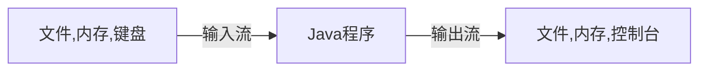

# `Java学习笔记——IO流与文件`

标签： `IO`、`Stream`、`File`

---

## 一、流（`Stream`）

> * 在Java中，把一组有序的数据序列称为流。程序的主要任务就是操纵数据。
> * 根据流中最小的数据单元，可以把流分为字节流和字符流。
> * 根据操作的方向，可以把流分为输入流和输出流两种。程序从输入流读取数据，向输出流写出数据。示例图如下：

