# `Java学习笔记——IO流与文件`

标签： `IO`、`Stream`、`File`

---

[toc]

---

## 一、文件（`File类`）

### 1. `File`对象创建方法

> * `Java`文件类以抽象的方式代表文件名和目录路径名。该类主要用于文件和目录的创建、文件的查找和文件的删除等。
> * `File`类提供管理文件或目录的方法。`File`实例表示真实文件系统中的一个文件或者目录,可以通过以下四种构造方法创建一个`File`对象。

![构造器][img1]

*(1).* `File(File parent, String child)`：参数`parent`表示根路径，参数`child`表示子路径。例如：

```java
    File file = new File(new File("src"), "test.txt");
```

*(2).* `File(String pathname)`：参数`pathname`表示文件路径或者目录路径。例如：

```java
    File file = new File("src/test.txt"); //等价于（1）中例子
```

*(3).* `File(String parent, String child)`：参数`parent`表示根路径，参数`child`表示子路径。例如：

```java
    File file = new File("src", "test.txt"); //等价于（2）中例子
```

*(4).* `File(URI uri)`：参数`uri`表示路径。例如：

```java
    File file = new File(new URI("src/test.txt")); //等价于（3）中例子
```

**只处理一个文件，使用第二个或者第四个构造方法更方便；如处理一个公共目录的若干子目录或文件，那么使用第一个或者第三个更方便。**

### 2. `File`类常用方法

假设现在在`/com/hzj/`目录下有个`test.txt`文件，内容如下：

```java
    qwertyuiopasdfghjklzxcvbnm
```

*(1).* `boolean exists()`：判断该文件或者目录是否存在。

*(2).* `long length()`：返回该文件的长度。

*(3).* `String getName()`：返回该文件名字。

*(4).* `boolean createNewFile()`：创建指定文件。

*(5).* `boolean delete()`：删除指定文件或者空目录。

*(6).* `boolean mkdir()`：创建一个目录（不连续创建），即如果该目录的父目录不存在话，那么就会创建失败。

*(7).* `boolean mkdirs()`：创建一个目录（连续创建），如果该目录的父目录不存在话，那么还会创建所有的父目录。

*(8).* `String[] list()`：返回指定目录下所有文件名或者子目录名所组成的字符串数组。

*(9).* `long lastModified()`：返回指定文件最后一次被修改的时间（从1970年1月1日凌晨12点到这个文件的修改时间
之间所经历的毫秒数）。

*(10).* `String getPath()`：返回指定文件或者目录的路径。

*(11).* `String getAbsolutePath()`：返回指定文件或者目录的绝对路径。

*(12).* `boolean renameTo(File dest)`：修改该目录或文件名字为指定的值。


```java
    File parent = new File("/com/hzj");
    File child = new File(parent, "test.txt");
    File file = new File("/com/hzj/test2.txt");
    File mkdir_test = new File("/com/hzj/aaa/bbb");

    System.out.println(child.exists()); // true
    System.out.println(child.length()); // 26
    System.out.println(child.getName()); // test.txt
    System.out.println(file.createNewFile()); // true(创建file文件)
    System.out.println(file.delete()); // true(删除file文件)
    System.out.println(mkdir_test.mkdir()); // false(没有aaa目录)
    System.out.println(mkdir_test.mkdirs()); // true(连续创建)

    System.out.println(parent.list()); // test.txt   aaa

    System.out.println(parent.renameTo(new File("/com/jzh"))); // true
```


## 二、`IO`流（`Stream`）

> * 在Java中，把一组有序的数据序列称为流。程序的主要任务就是操纵数据。
> * 根据流中最小的数据单元，可以把流分为字节流和字符流。
> * 根据操作的方向，可以把流分为输入流和输出流两种。程序从输入流读取数据，向输出流写出数据。示例图如下：


一定要搞清楚什么时候用输入流，什么时候用输出流。通俗的讲，就是把`Java`程序看为主体，如果要读文件，就是`文件系统 --> Java程序`，看箭头方法可知，从文件系统出，进入`Java`程序，即相对于`Java`程序就是`input`，如果要写文件，就是`Java程序 --> 文件系统`，看箭头方法可知，从`Java`程序出，进入文件系统，即相对于`Java`程序就是`output`。

下面是各个流之间的层次关系（放大了看）：

```mermaid
graph TB
IO流 --> 字符流
IO流 --> 字节流

字符流 --> Reader
字符流 --> Writer

字节流 --> InputStream
字节流 --> OutputStream

Reader --> BufferedReader
Reader --> InputStreamReader
Reader --> StringReader
Reader --> PipedReader
Reader --> CharArrayReader
Reader --> FilterReader

Writer --> BufferedWriter
Writer --> OutputStreamWriter
Writer --> StringWriter
Writer --> PrinterWriter
Writer --> PipedWriter
Writer --> CharArrayWriter
Writer --> FilterWriter

InputStream --> FileInputStream
InputStream --> FilterInputStream
InputStream --> ObjectInputStream
InputStream --> PipedInputStream
InputStream --> SequenceInputStream
InputStream --> StringBufferInputStream
InputStream --> ByteArrayInputStream

OutputStream --> FileOutputStream
OutputStream --> FilterOutputStream
OutputStream --> ObjectOutputStream
OutputStream --> PipedOutputStream
OutputStream --> ByteArrayOutputStream

InputStreamReader --> FileReader

FilterReader --> PushbackReader

OutputStreamWriter --> FileWriter

FilterInputStream --> BufferedInputStream
FilterInputStream --> DataInputStream
FilterInputStream --> PushbackInputStream

FilterOutputStream --> BufferedOutputStream
FilterOutputStream --> DataOutputStream
FilterOutputStream --> PrintStream
```



### 1. 字节流`InputStream` && `OutputStream`

**`InputStream`和`OutputStream`类处理的是字节流，也就是说，数据流中的最小单元为一个字节，它包括`8`个二进制位。**

#### （1）输入流（`InputStream`）

**主要方法：**

*(1).* `int available()`：返回可以从输入流中读取的字节数目。

*(2).* `abstract int read()`：从输入流读取一个`8`位的字节，把它转换为`0-255`之间的整数，并返回这一整数。如果遇到输入流的结尾，则返回`-1`。

*(3).* `int read(byte[] b)`：从输入流读取若干个字节，把它们保存到参数`b`指定的字节数组中。返回的整数表示读取的字节数。如果遇到输入流的结尾，则返回`-1`。使用`byte[]`数组可以降低物理读取次数。`byte[]`长度最大可以取到整个要读取的数据的长度。

*(4).* `int read(byte[] b, int off, int len)`：从输入流读取若干个字节，把它们保存到参数`b`指定的字节数组中。返回的整数表示读取的字节数。参数`off`指定在字节数组中开始保存数据的起始下标(默认为`0`)，参数`len`指定读取的字节数目。返回的整数表示实现读取的字节数。如果遇到输入流的结尾，则返回`-1`。

*(5).* `void close()`：关闭输入流，`InputStream`类本身的`close()`方法不执行任何操作。它的一些子类覆盖了`close()`方法，在`close()`方法中释放和流有关的系统资源。

*(6).* `long skip(long n)`：从输入流中跳过参数`n`指定数目的字节。

*(7).* `void mark(int readlimit)`：标记此输入流中的当前位置。

*(8).* `boolean markSupported()`：返回此输入流是否支持标记（`mark()`）和重置（`reset()`）方法。

**常用子类：**

`InputStream`是个抽象类，常用的子类有：`ByteArrayInputStream`，`DataInputStream`，`BufferedInputStream`，`PipedInputStream`，`FileInputStream`，`ObjectInputStream`。


#### （2）输出流（`OutputStream`）

**主要方法：**

*(1).* `void close()`：关闭输出流。`OutputStream`类本身的`close()`方法不执行任何操作。它的一些子类覆盖了`close()`方法，在`close()`方法中释放和流有关的系统资源。

*(2).* `void flush()`：`OutputStream`类本身的`flush()`方法不执行任何操作，它的一些带有缓冲区的子类(比如`BufferedOutputStream`和`PrintStream`类)覆盖了`flush()`方法。通过带缓冲区的输出流写数据时，数据先保存在缓冲区中，积累到一定程度才会真正写到输出流中。缓冲区通常用字节数组实现，实际上是指一块内存空间。`flush`：即使内容没有达到缓冲的标准大小,仍然输出到输出流中。只要使用到`buffer`的流,就一定要进行`flush`，否则最后很可能有数据没有完全达到要求而不能输出。

*(3).* `void write(byte[] b)`：把参数`b`指定的字节数组中的所有字节写到输出流。

*(4).* `void write(byte[] b, int off, int len)`：把参数`b`指定的字节数组中的所有字节写到输出流，参数`off`指定字节数组的起始下标，从这个位置开始输出由参数len指定数目的字节。

*(5).* `abstract void write(int b)`：向输出流写入一个字节。在向文件或控制台写数据时，采用上面两个`write`方法可以减少进行物理读文件或键盘的次数，因此能提高`I/O`操作的效率。


**常用子类：**

`OutputStream`是个抽象类，常用的子类有：`ByteArrayOutputStream`，`DataOutputStream`，`BufferedOutputStream`，`PipedOutputStream`，`FileOutputStream`，`ObjectOutputStream`。


#### （3）各输入流、输出流用法详解

##### (1). `ByteArrayInputStream` && `ByteArrayOutputStream`

**`ByteArrayInputStream`**：把字节数组转换为输入流。`ByteArrayInputStream`类有两个默认的构造方法：

> * `ByteArrayInputStream(byte[] b)`: 使用一个字节数组当中所有的数据做为数据源，程序可以像输入流方式一样读取字节，可以看做一个虚拟的文件，用文件的方式去读取它里面的数据。
> * `ByteArrayInputStream(byte[] b,int offset,int length)`: 从数组当中的第`offset`(`offset`从`0`开始)开始，一直取出`length`个这个字节做为数据源。

**`ByteArrayOutputStream`**：字节数组输出流在内存中创建一个字节数组缓冲区，所有发送到输出流的数据保存在该字节数组缓冲区中。  

主要方法：

> * `byte[] toByteArray()`：创建一个新分配的字节数组。数组的大小和当前输出流的大小，内容是当前输出流的拷贝。即把输出流转换为字节数组。
> * `void writeTo(OutputStream out)`：将此字节数组输出流的全部内容写入到指定的输出流参数中。

**示例（将字节数组转换为输入流，将输出流转换成字节数组）：**

```java
    System.out.println("-----使用ByteArrayInputStream(byte[] b)构建对象------");
    byte[] b1 = new byte[] { 'a', 'b', 'c', 'd', 'e', 'f', 'g', 'h' };
    InputStream bis1 = new ByteArrayInputStream(b1);
    System.out.println(bis1.available()); // 8
    int n1;
    bis1.skip(2); // 跳过两个字符
    while ((n1 = bis1.read()) != -1) {
        System.out.print((char) n1 + " "); // c d e f g h
    }
    bis1.close();

    System.out.println();
    System.out.println("----使用ByteArrayInputStream(byte[] b,int offset,int length)构建对象-----");

    byte[] b2 = new byte[] { 'a', 'b', 'c', 'd', 'e', 'f', 'g', 'h' };
    ByteArrayInputStream bis2 = new ByteArrayInputStream(b2, 2, 3);
    System.out.println(bis2.available()); // 3
    int n2;
    while ((n2 = bis2.read()) != -1) {
        System.out.print((char) n2 + " "); // c d e
    }
    bis2.close();

    System.out.println();
    System.out.println("----利用read(byte[] b)读取数据-----");

    byte[] b3 = new byte[] { 'a', 'b', 'c', 'd', 'e', 'f', 'g', 'h' };
    byte[] b4 = new byte[3];
    ByteArrayInputStream bis3 = new ByteArrayInputStream(b3);
    System.out.println(bis3.available()); // 8
    int n3;
    while ((n3 = bis3.read(b4)) != -1) { // 利用read(byte[] b)方法时，返回值是当前读的字符个数
        System.out.print(n3 + " "); // 3 3 2
    }
    bis3.close();

    System.out.println();
    System.out.println("----ByteArrayOutputStream用法-----");
    byte[] b5 = new byte[10];
    ByteArrayOutputStream bos5 = new ByteArrayOutputStream();
    bos5.write('a');
    bos5.write('b');
    bos5.write('c');
    bos5.write('d');
    bos5.write('e');
    bos5.write('f');
    bos5.flush();
    b5 = bos5.toByteArray(); // 将输出流转换成字节数组
    for (byte b : b5) {
        System.out.print((char) b); // abcdef
    }
    
    ByteArrayOutputStream bos6 = new ByteArrayOutputStream();
    bos5.writeTo(bos6); // 将bos5字节数组输出流的全部内容写入到指定的输出流参数（bos6）中。
    b5 = bos6.toByteArray(); // 将输出流转换成字节数组
    for (byte b : b5) {
        System.out.print((char) b); // abcdef
    }
```


##### (2). `FileInputStream` && `FileOutputStream`

**`FileInputStream`**：从文件中读取数据。`FileInputStream`类常用的两个构造方法：

> * `FileInputStream(File file)`：使用一个文件对象来创建一个输入流对象来读取文件。首先得使用 `File()`方法来创建一个文件对象。
> * `FileInputStream(String name)`：使用字符串类型的文件名来创建一个输入流对象来读取文件。

**`FileOutputStream`**：向文件中写入数据。如果该流在打开文件进行输出前，目标文件不存在，那么该流会创建该文件。`FileOutputStream`类的常用构造方法：

> * `FileOutputStream(File file)`：使用一个文件对象来创建一个输出流来写文件。首先得使用 `File()`方法来创建一个文件对象。
> * `FileOutputStream(String name)`：使用字符串类型的文件名来创建一个输出流对象来写文件。
> * `FileOutputStream(File file, boolean append)`：使用一个文件对象来创建一个输出流来写文件，同时给定一个append参数（默认`false`），用来指定是追加还是覆盖。
> * `FileOutputStream(String name, boolean append)`：使用字符串类型的文件名来创建一个输出流对象来写文件，同时给定一个append参数（默认`false`），用来指定是追加还是覆盖。

**示例（向文件中写入文件，并读取出来）：**

```java
    File file = new File("src/note/file_test.txt");
    OutputStream out = new FileOutputStream(file); // 写文件
    out.write('h');
    out.write('e');
    out.write('l');
    out.write('l');
    out.write('o');

    InputStream in = new FileInputStream(file); // 读文件
    System.out.println("可读取" + in.available() + "字节数"); // 可读取5字节数
    System.out.println(in.markSupported()); // false (不支持标记)
    int n;
    while ((n = in.read()) != -1) {
        System.out.print((char) n); // hello
    }

    in.close(); // 关闭资源
    out.close(); // 关闭资源
```

##### (3). `DataInputStream` && `DataOutputStream`

**`DataInputStream`**：用于读取基本类型数据，如`int`, `float`, `long`, `double`和`boolean`等。构造方法为：

> * `DataInputStream(InputStream in)`：需要传入一个`InputStream`对象，通常传入`FileInputStream`对象。

常用方法：

> * `int skipBytes(int n)`：从输入流中跳过`n`个字节的数据。
> * `boolean readBoolean()`：从输入流中读取`1`个字节，将它转换为`boolean`类型的数据。
> * `byte readByte()`：从输入流中读取`1`个字节，将它转换为`byte`类型的数据。
> * `char readChar()`：从输入流中读取`2`个字节，将它转换为`char`类型的数据。
> * `double readDouble()`：从输入流中读取`8`个字节，将它转换为`double`类型的数据。
> * `float readFloat()`：从输入流中读取`4`个字节，将它转换为`float`类型的数据。
> * `int readInt()`：从输入流中读取`4`个字节，将它转换为`int`类型的数据。
> * `long readLong()`：从输入流中读取`8`个字节，将它转换为`long`类型的数据。
> * `short readShort()`：从输入流中读取`2`个字节，将它转换为`short`类型的数据。
> * `String readUTF()`：从输入流中读取`1`到`3`个字节的串，将它转换为`UTF-8`字符编码的字符串。

**`DataOutputStream`**：用于写入基本数据类型。如`int`, `float`, `long`, `double`和`boolean`等。构造方法为：

> * `DataOutputStream(OutputStream out)`：需要传入一个`OutputStream`对象，通常传入`FileOutputStream`对象。

常用方法如下（这些方法都是将指定的基本数据类型以字节的方式写入到输出流）：

> * `void writeBoolean(boolean v)`
> * `void writeByte(int v)`
> * `void writeChar(int v)`
> * `void writeDouble(double v)`
> * `void writeFloat(float v)`
> * `void writeInt(int v)`
> * `void writeLong(long v)`
> * `void writeShort(int v)`
> * `void writeUTF(String str)`：写入的时候，首先会写入两个字节，代表字符串的长度，然后再以字节的方式把字符串写入。可查看`writeUTF()`源代码理解。


**示例（向文件中写入指定类型的数据，并按照指定数据类型读取出来）：**

```java
    // -----------写入DataOutputStream-----------
    OutputStream fos = new FileOutputStream("src/note/data_test.txt");
    DataOutputStream dos = new DataOutputStream(fos);
    dos.writeInt(1);
    dos.writeLong(100);
    dos.writeUTF("hello world!");
    dos.writeDouble(1.23);
    dos.writeBoolean(false);
    dos.writeByte('a');
    dos.writeChar('b');
    dos.writeFloat(1.1f);

    // -----------从DataOutputStream读出-----------
    InputStream fis = new FileInputStream("src/note/data_test.txt");
    DataInputStream dis = new DataInputStream(fis);
    System.out.println(dis.readInt());
    System.out.println(dis.readLong());
    System.out.println(dis.readUTF());
    System.out.println(dis.readDouble());
    System.out.println(dis.readBoolean());
    System.out.println(dis.readByte());
    System.out.println(dis.readChar());
    System.out.println(dis.readFloat());
    /* 结果：
            1
            100
            hello world!
            1.23
            false
            97
            b
            1.1
        */
```

如果需要跳过某些类型数据，只需利用`skipBytes(n)`方法跳过该类型所占字节数即可。其中`String`类型比较特殊，需要使用`skipBytes(out.readShort())`，因为`writeUTF()`会先写入一个`short`类型的数据，代表`String`的长度。示例：

```java
    // -----------写入DataOutputStream-----------
    OutputStream fos = new FileOutputStream("src/note/data_test.txt");
    DataOutputStream dos = new DataOutputStream(fos);
    dos.writeInt(1);
    dos.writeLong(100);
    dos.writeUTF("hello world!");
    dos.writeDouble(1.23);

    // -----------从DataOutputStream读出-----------
    InputStream fis = new FileInputStream("src/note/data_test.txt");
    DataInputStream dis = new DataInputStream(fis);
//		System.out.println(dis.readInt());
    dis.skipBytes(4); // 跳过int类型，int占4个字节
    System.out.println(dis.readLong());
//		System.out.println(dis.readUTF());
    dis.skipBytes(dis.readShort()); // 跳过String类型的数据
    System.out.println(dis.readDouble());
    /* 结果：
            100
            1.23
        */
```

##### (4). `ObjectInputStream` && `ObjectOutputStream`

**`ObjectInputStream`**：对象的反序列化（对象需要实现`Serializable`序列化接口）。构造方法：

`ObjectInputStream(InputStream in)`：需要传入一个`InputStream`对象，可以传入`FileInputStream`对象。

常用方法：

> * `Object readObject()`：读取一个对象。

**`ObjectOutputStream`**：对象的序列化（对象需要实现`Serializable`序列化接口）。构造方法：

`ObjectOutputStream(OutputStream out)`：需要传入一个`OutputStream`对象，可以传入`FileInputStream`对象。

常用方法：

> * `void writeObject(Object obj)`：写入一个对象。

**示例（对象的序列化与反序列化，利用文件流来实现数据持久化）：**

```java
import java.io.FileInputStream;
import java.io.FileOutputStream;
import java.io.IOException;
import java.io.InputStream;
import java.io.ObjectInputStream;
import java.io.ObjectOutputStream;
import java.io.OutputStream;
import java.io.Serializable;

public class Test {
	public static void main(String[] args) throws IOException {
        // 借助FileOutputStream来实现对象的持久化存储，即存入文件

		// -----------写入ObjectOutputStream-----------
		OutputStream fos = new FileOutputStream("src/note/data_test.txt");
		ObjectOutputStream oos = new ObjectOutputStream(fos);
		oos.writeObject(new Student("张三"));
		oos.close();
		fos.close();

		// -----------从DataOutputStream读出-----------
		InputStream fis = new FileInputStream("src/note/data_test.txt");
		ObjectInputStream ois = new ObjectInputStream(fis);
		try {
			Student s = (Student) ois.readObject();
			System.out.println(s); // Student [name=张三]
			fis.close();
			ois.close();
		} catch (ClassNotFoundException e) {
			e.printStackTrace();
		}
	}
}

class Student implements Serializable { // Stduent类，实现Serializable接口
	private String name;

	public Student() {
	}

	public Student(String name) {
		super();
		this.name = name;
	}

	@Override
	public String toString() {
		return "Student [name=" + name + "]";
	}

}
```

##### (5). `PipedInputStream` && `PipedOutputStream`

管道流，用于线程间的通信。一个线程的`PipedInputStream`对象从另外一个线程的`PipedOutputStream`对象读取输入。要使管道流有用，必须同时构造管道输入流和管道输出流。

**`PipedInputStream`**：管道输入流从一个管道输出流中读取数据。

**`PipedOutputStream`**：管道输出流给管道输入流传输数据。

**示例（利用多线程实现管道传输`Student`对象）：**

```java
import java.io.IOException;
import java.io.ObjectInputStream;
import java.io.ObjectOutputStream;
import java.io.PipedInputStream;
import java.io.PipedOutputStream;
import java.io.Serializable;

/*
 * 开启两个线程，一个用于管道输出流用于写入Student对象，另一个用于管道输入流读取Student对象
 */
public class Test {
	public static void main(String[] args) throws IOException {
		PipedOutputStream pos = new PipedOutputStream();
		PipedInputStream pis = new PipedInputStream(pos);
		PipedOutputStreamThread thread1 = new PipedOutputStreamThread(pos);
		PipedInputStreamThread thread2 = new PipedInputStreamThread(pis);
		thread1.start();
		thread2.start();
	}
}

class PipedOutputStreamThread extends Thread { // 管道输出流线程
	PipedOutputStream pos;

	public PipedOutputStreamThread(PipedOutputStream pos) {
		this.pos = pos;
	}

	@Override
	public void run() {
		try {
            // 用ObjectOutputStream包装管道输出流，使之有序列化对象功能
			ObjectOutputStream oos = new ObjectOutputStream(pos); 
			oos.writeObject(new Student("李四"));
			oos.close();
			pos.close();
		} catch (IOException e) {
			e.printStackTrace();
		}
	}
}

class PipedInputStreamThread extends Thread { // 管道输入线程
	PipedInputStream pis;

	public PipedInputStreamThread(PipedInputStream pis) {
		this.pis = pis;
	}

	@Override
	public void run() {
		try {
            // 用ObjectInputStream包装管道输入流，使之有反序列化对象功能
			ObjectInputStream ois = new ObjectInputStream(pis);
			Student s = (Student) ois.readObject();
			System.out.println(s); // Student [name=李四]
			pis.close();
			ois.close();
		} catch (Exception e) {
			e.printStackTrace();
		}
	}
}

class Student implements Serializable {
	private String name;

	public Student() {
	}

	public Student(String name) {
		super();
		this.name = name;
	}

	@Override
	public String toString() {
		return "Student [name=" + name + "]";
	}

}
```

##### (6). `BufferedInputStream` && `BufferedOutputStream`

**`BufferedInputStream`**：字节缓冲输入流。`BufferedInputStream`类覆盖了被过滤的输入流的读数据行为，利用缓冲区来提高读数据的效率。`BufferedInputStream`类先把一批数据读入到缓冲区，接下来`read()`方法只需要从缓冲区内获取数据，就能减少物理性读取数据的次数。构造方法：

> * `BufferedInputStream(InputStream in)`：参数`in`指定需要被过滤的输入流。
> * `BufferedInputStream(InputStream in, int size)`：参数`in`指定需要被过滤的输入流。参数`size`指定缓冲区的大小，以字节为单位。

**`BufferedOutputStream`**：字节缓冲输出流。`BufferedOutputStream`类覆盖了被过滤的输出流的写数据行为，利用缓冲区来提高写数据的效率。`BufferedOutputStream`类先把一批数据写入到缓冲区，接下来只需要`flush()`将所有缓冲的输出字节写出到底层输出流中，就能减少物理性存数据的次数。构造方法：

> * `public BufferedOutputStream(OutputStream out)`：采用的默认的缓冲区大小 ,来构造一个字节缓冲输出流对象。
> * `public BufferedOutputStream(OutputStream out,int size)`：指定`size`缓冲区大小构造缓冲输出流对象。

主要方法：

(1). `void flush()`：刷新此缓冲的输出流，让所有缓冲的输出字节被写出到底层输出流中。
(2). `void close()`：关闭此输出流并释放与此流有关的所有系统资源。`FilterOutputStream`的 `close`方法先调用其`flush`方法，然后调用其基础输出流的`close`方法。

**示例：**

```java
    BufferedOutputStream bos = new BufferedOutputStream(new FileOutputStream("test.txt"));
    bos.write("qwertyuiopasdfghjklzxcvbnm".getBytes());
    bos.flush();
    bos.close();

    BufferedInputStream bis = new BufferedInputStream(new FileInputStream("test.txt"));
    int n;
    while ((n = bis.read()) != -1) {
        System.out.print((char) n); // qwertyuiopasdfghjklzxcvbnm
    }
    bis.close();
```


### 2. 字符流`Reader` && `Writer`

**在许多应用场合，`Java`应用程序需要读写文本文件。在文本文件中存放了采用特定字符编码的字符，为了便于读于各种字符编码的字符，`java.io`包中提供了`Reader`/`Writer`类，它们分别表示字符输入流和字符输出流。**

> * 在不同的操作系统有着不同的字符编码，`windows`默认是`gbk`或`gbk2312`，`unix`是`utf-8`，`mac`是`euc_cn`。
> * 在处理字符流时，最主要的问题是进行字符编码的转换。`Java`语言采用`Unicode`字符编码。对于每一个字符，`Java`虚拟机会为其分配两个字节的内存。而在文本文件中，字符有可能采用其他类型的编码，比如`GBK`和`UTF-8`字符编码等。

在默认情况下，`Reader`和`Writer`会在本地平台的字符编码和`Unicode`字符编码之间进行编码转换。

![编码转换1][img2]

如果要输入或输出采用特定类型编码的字符串，可以使用`InputStreamReader`类和`OutputStreamWriter`类。在它们的构造方法中可以指定输入流或输出流的字符编码。

![编码转换2][img3]


#### （1）输入流（`Reader`）

> * `Reader`类能够将输入流中采用其他编码类型的字符转换为`Unicode`字符，然后在内存中为这些`Unicode`字符分配内存。

**主要方法：**

> * `abstract void close()`：关闭流并释放与其关联的所有系统资源。
> * `void mark(int readAheadLimit)`：标记流中的当前位置。
> * `boolean markSupported()`：判断此流是否支持`mark()`操作。
> * `int read()`：读一个字符。
> * `int read(char[] cbuf)`：将字符读入数组。
> * `abstract int read(char[] cbuf, int off, int len)`：将字符读入数组的一部分。
> * `int read(CharBuffer target)`：尝试将字符读入指定的字符缓冲区。
> * `boolean ready()`：判断此流是否可以读取。
> * `void reset()`：重置流。
> * `long skip(long n)`：跳过指定长度字符。

**常用子类：**

`Reader`是个抽象类，常见子类有：

> * `CharArrayReader`：把字符数组转换为`Reader`，从字符数组中读取字符。
> * `BufferedReader`：过滤器，为其他`Reader`提供读缓冲区，此外，它的`readLine()`方法能够读入一行字符串。
> * `StringReader`：把字符串转换为`Reader`，从字符串中读取字符。
> * `PipedReader`：连接一个`PipedWriter`。
> * `PushBackReader`：能把读到的字符压回到缓冲区中，通常用做编译器的扫描器，在程序中一般很少使用它。
> * `InputStreamReader`：过滤器，把`InputStream`转换为`Reader`，可以指定字符编码。
> * `FileReader`：从文件中读取字符。


#### （2）输出流（`Writer`）

> * `Writer`类能够把内存中的`Unicode`字符转换为其他编码类型的字符，再写到输出流中。

**主要方法：**

> * `Writer append(char c)`：将指定的字符追加到此`writer`。
> * `Writer append(CharSequence csq)`：将指定的字符序列追加到此`writer`。
> * `Writer append(CharSequence csq, int start, int end)`：将指定字符序列的子序列追加到此`write`r
> * `abstract void	close()`：关闭流，关闭前先`flush()`。
> * `abstract void	flush()`：刷新流。
> * `void write(char[] cbuf)`：向`Writer`中写一个字符数组。
> * `abstract void	write(char[] cbuf, int off, int len)`：向`Writer`中写一个字符数组的一部分。
> * `void write(int c)`：向`Writer`中写一个字符。
> * `void write(String str)`：向`Writer`中写一个字符串。
> * `void	write(String str, int off, int len)`：向`Writer`中写一个字符串的一部分。


**常用子类：**

`Writer`是个抽象类，常用的子类有：

> * `BufferedWriter`：带有缓冲的`Writer`。
> * `OutputStreamWriter`：过滤器，把`Writer`转换为`OutputStream`，可以指定字符编码。
> * `PrinterWriter`：打印流。
> * `StringWriter`：将`Writer`转化为字符串。
> * `PipedWriter`：连接一个`PipedReader`。
> * `CharArrayWriter`：将`Writer`写入字符数组。
> * `FileWriter`：将字符写入文件。


#### （3）各输入流、输出流用法详解

##### (1). `InputStreamReader` && `OutputStreamWriter`

**`InputStreamReader`**：字符输入流。`InputStreamReader`类把`InputStream`类型转换为`Reader`类型，即把字节输入流转换成字符输入流。构造方法：

> * `InputStreamReader(InputStream in)`：按照本地平台的字符编码读取输入流中的字符。
> * `InputStreamReader(InputStream in, String charsetName)`：按照指定的字符编码读取输入流中的字符。

**示例（两种方式创建`InputStreamReader`对象，将`FileInputStream`字节流转换为`InputStreamReader`字符流）：**

```java
    //--------------用InputStreamReader(InputStream in)构建对象--------------
    // 创建FileInputStream对象（字节输入流）
    InputStream fis = new FileInputStream("src/note/test.txt");
    // 创建InputStreamReader对象，把FileInputStream字节流转换为字符流
    Reader isr = new InputStreamReader(fis);
    int n;
    while ((n = isr.read()) != -1) {
        System.out.print((char) n); // hello，我是张三。
    }
    isr.close();
    fis.close();
    
    
    //---------------InputStreamReader(InputStream in, String charsetName)构件对象-------------
    // 创建FileInputStream对象（字节输入流）
    InputStream fis1 = new FileInputStream("src/note/test.txt");
    // 创建InputStreamReader对象，把FileInputStream字节流转换为字符流，并且制定字符编码为utf-8
    Reader isr1 = new InputStreamReader(fis1, "utf-8");
    int n1;
    while ((n1 = isr1.read()) != -1) {
        System.out.print((char) n1); // hello，我是张三。
    }
    isr1.close();
    fis1.close();
```

**`OutputStreamWriter`**：字符输出流。`OutputStreamWriter`类把`OutputStream`类型转换为`Writer`类型，即把字节输出流转换成字符输出流。构造方法：

> * `OutputStreamWriter(OutputStream out)`：创建使用默认字符编码的`OutputStreamWriter`。
> * `OutputStreamWriter(OutputStream out, Charset cs)`：创建一个使用给定字符集的`OutputStreamWriter`。
> * `OutputStreamWriter(OutputStream out, CharsetEncoder enc)`：创建使用给定`charset`编码器的`OutputStreamWriter`。
> * `OutputStreamWriter(OutputStream out, String charsetName)`：创建一个使用指定`charset`的`OutputStreamWriter`。


**示例（用`OutputStreamWriter`向文件中写入字符、字符串）：**

```java
    // 创建文件输出字节流
    OutputStream fos = new FileOutputStream("src/note/test.txt");
    // 将文件输出字节流转换为字符流
    OutputStreamWriter osw = new OutputStreamWriter(fos);
    // 向流中添加字符
    osw.append('胡');
    // 向流中写入字符串
    osw.write("hello world");
    osw.flush();
```

##### (2). `FileReader` && `FileWriter`

**`FileReader`**：`InputStreamReader`的一个子类，用于从文件中读取字符数据。该类只能按照本地平台的字符编码来读取数据，用户不能指定其他字符编码类型。构造方法：

> * `FileReader(File file)`：参数`file`指定需要读取的文件。
> * `FileReader(String name)`：参数`name`指定需要读取的文件的路径。

**`FileWriter`**：`OutputStreamWriter`的一个子类，用于向文件中写入字符数据。该类只能按照本地平台的字符编码来写入数据，用户不能指定其他字符编码类型。构造方法：

> * `FileWriter(File file)`：参数`file`指定需要写入的文件。
> * `FileWriter(File file, boolean append)`：参数`file`指定需要写入的文件，参数`append`代表是追加还是覆盖。
> * `FileWriter(FileDescriptor fd)`：构造与文件描述符关联的`FileWriter`对象。
> * `FileWriter(String fileName)`：参数`fileName`指定需要写入的文件的路径。
> * `FileWriter(String fileName, boolean append)`：指定需要写入的文件的路径，参数`append`代表是追加还是覆盖。

**示例（用`FileWriter`向文件写入字符，并用`FileReader`读取出来）：**

```java
    FileWriter fw = new FileWriter("src/note/test.txt");
    fw.write("hello world!");
    fw.flush();
    fw.close();
    FileReader fr = new FileReader("src/note/test.txt");
    int n;
    while((n = fr.read()) != -1) {
        System.out.print((char)n); // hello world!
    }
    fr.close();
```


##### (3). `BufferedReader` && `BufferedWriter`

带有缓存的字符输入输出流，常用于读写文件，效率高。`BufferedWriter`提供了`newLine()`方法，`BufferedReader`提供了`readLine()`方法。

**`BufferedReader`**：带有缓存的字符输出流。构造方法：

> * `BufferedReader(Reader in)`：创建使用默认大小的输入缓冲区的缓冲字符输入流。需要传入一个`Reader`类型的参数，可以传入`FileReader`类型，可以理解为给`FileReader`添加新功能（读一行）。
> * `BufferedReader(Reader in, int sz)`：创建使用指定大小的输入缓冲区的缓冲字符输入流。需要传入一个`Reader`类型的参数，可以传入`FileReader`类型，可以理解为给`FileReader`添加新功能（读一行）。

**`BufferedWriter`**：带有缓存的字符输入流。构造方法：

> * `BufferedWriter(Writer out)`：创建使用默认大小的输入缓冲区的缓冲字符输出流。需要传入一个`Writer`类型的参数，可以传入`FileWriter`类型，可以理解为给`FileWriter`添加新功能（写一行）。
> * `BufferedWriter(Writer out, int sz)`：创建使用指定大小的输入缓冲区的缓冲字符输出流。需要传入一个`Writer`类型的参数，可以传入`FileWriter`类型，可以理解为给`FileWriter`添加新功能（写一行）。

**示例（利用`BufferedReader`和`BufferedWriter`实现文件的读写，写一行、读一行）：**

```java
    FileWriter fw = new FileWriter("src/note/test.txt");
    BufferedWriter bw = new BufferedWriter(fw);
    bw.write("hello world!");
    bw.newLine(); // 另起一行
    bw.write("第二行");
    bw.flush();
    bw.close();
    fw.close();
    FileReader fr = new FileReader("src/note/test.txt");
    BufferedReader br = new BufferedReader(fr);
    String line;
    while ((line = br.readLine()) != null) {
        System.out.println(line);
        // hello world!
        // 第二行
    }
    br.close();
    fr.close();
```


## 三、 实例

### 1. 本地文件传输（网络传输文件基础）

```java
import java.io.File;
import java.io.FileInputStream;
import java.io.FileOutputStream;

/**
 * @author HZJ
 * @date 2019年6月14日 下午2:42:15
 * @description 实现文件的复制功能，inPath代表输入的文件路径，outPath代表输出的文件路径。
 */
public class Test {
	private static String inPath = "src/note/in_test.jpg"; // 输入图片路径
	private static String outPath = "src/note/out_test.jpg"; // 输出图片路径

	public static void main(String[] args) throws Exception {

		// 创建输入文件对象
		File in_file = new File(inPath);
		if(!in_file.exists()) {
			throw new Exception("文件不存在！");
		}
		// 创建文件输入流（字节流）
		FileInputStream in = new FileInputStream(in_file);

		// 创建输出文件对象
		File out_file = new File(outPath);
		// 创建文件输出流（字节流）
		FileOutputStream out = new FileOutputStream(out_file);

		byte[] b = new byte[1024]; // 利用一个数组缓存，提高读取效率
		int n;
		while ((n = in.read(b)) != -1) { // n = -1 说明已经读到流的末尾了
			// 注意这里第三个参数不能是数组b的长度（1024），否则最后一次循环可能会多写数据到out流中，
			// 因为文件的可读字节不一定是b的长度（1024）的整数倍。
			out.write(b, 0, n);
		}
		out.flush();
		out.close();
		in.close();
	}
}
```

### 2. 网络传输文件

要先启动`Server.java`，再启动`Client.java`。

**`Client.java`：**

```java
package note;

import java.io.FileInputStream;
import java.io.IOException;
import java.io.OutputStream;
import java.net.Socket;

public class Client {
	// 服务器ip地址
	private static String ip = "127.0.0.1";
	// 服务器端口
	private static int port = 10000;
	//本地文件，即需要发送的文件
	private static String client_file = "src/note/client.jpg";

	public static void main(String[] args) {
		try {
			System.out.println("正在连接服务器。。。");
			// 连接服务器
			Socket socket = new Socket(ip, port);
			System.out.println("与服务器连接成功！准备发送文件。。。");
			// 获取套接字输出流
			OutputStream out = socket.getOutputStream();
			// 获取本地文件输入流
			FileInputStream in = new FileInputStream(client_file);
			// 缓存数组
			byte[] b = new byte[1024];
			// 每次读出的字节长度
			int n;
			while ((n = in.read(b)) != -1) {
				// 将字节数组b中长度为n的子数组写入out
				out.write(b, 0, n);
			}
			out.flush();
			out.close();
			in.close();
			socket.close();
			System.out.println("文件发送成功！");
		} catch (IOException e) {
			e.printStackTrace();
		}
	}

}

```

**`Server.java`：**

```java
package note;

import java.io.FileOutputStream;
import java.io.IOException;
import java.io.InputStream;
import java.net.ServerSocket;
import java.net.Socket;

public class Server {
	// 监听10000端口号
	private static int port = 10000;
	// 本地文件，即接收到的文件存放的地址
	private static String server_file = "src/note/server.jpg";

	public static void main(String[] args) {
		try {
			System.out.println("服务器启动中。。。");
			// 监听10000端口号，等待客户端连接
			ServerSocket serverSocket = new ServerSocket(port);
			System.out.println("服务器启动成功，监听" + port + "端口，等待客户端连接。。。");
			// 与客户端建立连接
			Socket server = serverSocket.accept();
			System.out.println("与客户端成功建立连接，接收文件中。。。");
			// 获取套接字输入流
			InputStream in = server.getInputStream();
			// 获取本地文件输出流
			FileOutputStream out = new FileOutputStream(server_file);
			// 缓存数组
			byte[] b = new byte[1024];
			// 每次读出的字节长度
			int n;
			while ((n = in.read(b)) != -1) {
				// 将字节数组b中长度为n的子数组写入out
				out.write(b, 0, n);
			}
			out.flush();
			out.close();
			in.close();
			server.close();
			serverSocket.close();
			System.out.println("服务器接收文件成功！文件路径：" + server_file);
		} catch (IOException e) {
			e.printStackTrace();
		}
	}

}
```


[img1]:data:image/png;base64,iVBORw0KGgoAAAANSUhEUgAAAtsAAAEcCAYAAAAWdXg5AAAAAXNSR0IArs4c6QAAAARnQU1BAACxjwv8YQUAAAAJcEhZcwAADsMAAA7DAcdvqGQAAE6CSURBVHhe7b3/zydHded7/5ENERccXa5ztdix1vYi8JWIJsIi612c3EiYXWJtzBcP9thkyVWW4BgZsGBGNp7BvkQ4kUZ3bU/EsmbsJAgLZGtsLlFgxsYra4bICIlIBoGI+C2/1e361l116lRX9ef59PP19ZZe8vPprq46dc6p6vPpp+fx//Iv//IvBgAAAAAAtg/FNgAAAADASlBsAwAAAACsBMU2AAAAAMBKUGwDAAAAAKxEu9j+f/4VHEW0XAAAAACARVBsg46WCwAAAACwCIpt0NFyAQAAAAAWQbENOlouAAAAAMAiKLZBR8sFAAAAAFgExTboaLkAAAAAAIug2AYdLRcAAAAAYBEU26Cj5QIAAAAALIJiG3S0XAAAAACARaxXbD/6ZvP3915rPnLsXebq3/o/zVsHrnn3jebuj77NvH5aaQ/7Cy0XAAAAAGAR6xTbp68yXzh2kyuwNR74c+Wa3eDU1eZ2Z8MN5olTyvmV+ad7b/A++PdXm39Szu8rtFwAAAAAgEWsUGy/yTz3gVho32Ru/8hV5vUvhXNf+nXz2p++3Tzx6an9rz73v5sHbn2nuSYU4te8+3rzwH95i/n5o7HNm80T/96fe+vtv2Fe/y+/ZW59h+/71g9cbV5LnpL/031vT56k32RuOHajufuDbzOv23Ox0JXcfpUY423mtXvDGK4ovso8ENrefu+bFZvs9cGGR99kLg3X3vbuaf7Hbn27+ftHkvaC8YvHo79uXvjovzG3vitce8O7zK1/8K/NC8mXgmkO15jnPne1+dR7bNvwxeH0W8wTH7jRHHO+GXjHO83v3vpb5q/+/E2TfUvQcgEAAAAAFrH9YvuRt5m7QyF59Qf+N/MrrU3gV5++xhwLbSXH/uiqcG1SqN5w0/hKytjuo2/x/X3+N82t4pznGvP3w/nuYjsdY1Gx/Wbztf+gPc23xXCr2K5dO3DDDeZroeCe5jDYeENsY/v/NfPCf9Kvn2xeiJYLAAAAALCI7Rfbf37NWOjd/SdzT1WTAvTd15gXHhmOPfom88Lt7wzXx1c90kJ4OPZ52y45Fl/JiOO+9zfN6/Gp+Ok3m9f+7K3TKxvV10jSYvid5oH7gt1f+rXhv1OxPc0naR+L7Qfebm4K7W790FXjk/lfff4t5jU7t+Hn6mskg+3xafztJ/5Xf2z48nB7KKivDmOkXxiO3f4bfoxHf838KvHHp/4s9Dkc//nn32peeJAn2wAAAAB7xR4W21MRe9uJ5OnrF37T3BaOx6e+Y2GbPCl/7WPv8Mdi4Zo82b7m3e8wv/s715tP/dH/YZ578NenvnuK7eJp/GTn9K55WWxPhfBvmefiazOCWrE9XXuteWF8feZfmRc+GMYI7etjJE+2b3jXMPd3mNv+4Frz5XuTV3iWouUCAAAAACxiD18j2aDYHl/ZqBSup95qvnb3NeYLH7je/G7y7van/sw+obbnO4rtZAxP8hrJH8fCfWj/3rz97hbb/tWY2M7x6JvMa392tfnyH11r7v5375je3X7Pb7p31rO2PWi5AAAAAACL2MN/IJkUuL2vkcwV25+/yjz34JvNz+NYj77FfPl3/HXje8tjsf0O8+XPhXaOvmL7pg/+hvvy8PP7knfNY/slr5H8zr82ryVF9fLXSGSx/SZz6b8Ofn44fKkY+Pn/fV2lbSdaLgAAAADAIlYotgc6//Tf4n8gOVdsJ6+v5LzTPPIZf0361D3iC/G5Ylv7x4fJP1Ac28/9A0nf18//5N9Uzi39B5KygE7sF1z9f73N/Dxr24mWCwAAAACwiHWKbUvn/9Rm2Z/+mym2H77K/JV9fST5s3s3HLvePHJf8s72wOt/Ev90oKddbA+cfqv58n/w87j6XTcMfV6lt6/+6b94/s3m2Q/823Gu2essC//0X15s/5p57U/e7l4fuSF+CXjHO81t4k8jLkLLBQAAAABYxHrFNhxstFwAAAAAgEVQbIOOlgsAAAAAsAiKbdDRcgEAAAAAFkGxDTpaLgAAAADAIii2QUfLBQAAAABYBMU26Gi5AAAAAACLoNgGHS0XAAAAAGARFNugo+UCAAAAACyCYht0tFwAAAAAgEXMFtu//OUvzY9+8jMAAAAAANgAim0AAAAAgJWg2AYAAAAAWAmKbQAAAACAlaDYBgAAAABYCYptAAAAAICVoNgGAAAAAFgJim0AAAAAgJWg2AYAAAAAWAmKbQAAAACAlaDYBgAAAABYie0U25e/Y86e/Lh5/803mOuuv9Zcd9O7ze/d9Rlz9qWf6O3hAHLZfOUjQ2xtfCM2znd83Hzuye+YV3+sXbMHPPcZb9tHzpqL2vmlbLs/AAAAOFLsvNi+eM7c+dtJAZby2ef1a2Df8Y3P+pjdcfayel4tthNuPH7WfHc/FNwU2wAAALCP2GGxnRRgN33YPPb8ZXMlFFxX/uGb5pEnvyfar8zLZ80drvj7sPnKy8r5lYiF6kH+crGo2I7z/NFl8+2zf2pucT6/1tzyyHfENQeIWFRf/xnzDe08AAAAwAbsrNi+eNb8YSi07nzyR3qbwMW/e8zc88F3mxtd+xvMb3/wPvOVC8k1yRPEC88/Zu5wr6QM7f74cXPhH2M/PzEXzt6Xv65yx8fNI88N/YzFUs79z9nrnjf3u89DEX7hefPIcWuHLcjj8dhuoFKwX/ybL5o7/yDa/05zy11fNN+4XHnaOz4FHex98jPmzve9M5zz151P+z37YX/us980331ymJv9LUGlaH/1ucGHd/y++e2bwji/fYv5w08N/hr9M9lz/9+9Yp761G3mJtfuNnP/+aSI/vFlc/6hD/t+hnOf/OtXzPlNim3HT4ZC/WZ//KYvTIXqy980J++abL3pfXeZ+//HK9N1//g985XBvnj+xpt/3/zhJx4bfBrOD+g+t+eSef7NK+ZsmKeLYfEkWvfJjTf7ebtxYgwyQvy1J9uD7Wc/e5e5Jf5GZ4jDnQ9901wcn+wn+fbSd0K+2TE/bh7j1SoAAIAjxc6K7bHAzQtTyZW/uc8XfQW3mM99KxQfsa/33mJuicVk4JYvhSfkz3/R3Jwcj7gCsavYvtnc8r5QqC8otr87FGO+4Eux5+eL7QuP365cN3DTh83Z0PdY6L1vmHc8Xym29aJwKOL++GvmVddmsueWob+s3U1/ap4Khey3HxHnhjjc8j7/8/Jie4jv+ftCP8FnL58zd4gYem4wd/w33/+3HwoFekaPz3Nb0nm2iu3CJ8O8T15YWGz/+Hvmsf8ccyjnxuPnwphavgXe95i54NoAAADAUWAXiu3L5uxxX2jc+KmhKLRP/378ivnK8VCExEJx7OsWc//f2SfePzHnHwgFWShiLv43XxTdcvJ5c/E1X6RfuXzZfPfVULBXXyOZiuqbBxvcE0hHT7H9vPlcKBxvuf9Z890f+XZXXn3FXAw/66+RTNe9/7Hv+NdrLn/T3B+K2pvDKxdTofdh80h80j8+IRW8mj8tnoivPkyF5fgO9cU4nxuGLza2TcWu9/pjOy22z746FMp/dXv4rPDeL5pvjzkxfNl67rJ51T6Z//FPzKsvR5+2fJ7Y8pHHzLfj03A7l5li++YHnh3z77HopyGX3LVj/onXSGR/3/pC+BJw2xAvn3ev/t1nwhelm13xnubbLZ/9phvzytDGf1H0Phr7BwAAgEPNLrxGMhUeaSE3FpmxiIlFzfsfH5/8FW3+8TvmsU/cPv36fiB9HaBdbMdiSB6fKbbHz0kbgVpsV66Tbcc5jk+na3zPPBIK9ZKy2P7k+fi6gphjxa7z9/tjO3qNxBXS9sm59tQ64m298vzj5p47bkl+4+FfLXrq4tBn0+eTLff8tci7mWL7k38ztfvu47fl7TqL7enLUdpO5lH8/Pvmse+GNjKvxmsBAADgMLML/0AyebL9iXPhqfLMk+2xSFKK7ddeMRde/tE4xqvf+qJ5vz0fC5+xoLndfMUWbaGfqfipP/G+M7ze8N3HYzG1wZPtB77pPse+xyfIDz3vn6jOPdkWT4sLXj0X5ja9evPqf78vPGUti+2pSC0LweLJ9mvPbvZk2/4DycfvGgvm+A8kX/3rj/t27/uMOf/a1MeVl79nvvGSL45f/YfvmYuXwxeCH//IfOORUPy6vvufbBfF+EyxPT7Z/tH3Zp9snw/5pfaXPNk++a0wl+qT7STfKLYBAACOJDsstgc6/vTfone254rtsSAS3HPOF+yXv2buyc5NBbNebP/IPPXHafuBm24IxdTUdv79YeVJbpj3one2W8X2T75jToaCOHLjf7zN/J77eUmxvYV3thWyP/3348HW2lP4MM/xC4og/oak953tJcV27Z1td90F+e8Bgk9lf4ve2U7yjWIbAADgSLLzYtvS8T+1WfLXSKrF9svPms994nbze8k47//E48lfsPiJ+faXwl/ZcOPEwqZWbA9c/Jr55H+0fy1ksOn4F835b+lFUf0vY6R9hHHHwnnJXyNpFdvDl5aXzk622r/SMnz2ti4rtnf810gic/9TG+Uvdti/NvLf/8HnxMXzX8j+sop9Heiex8NvAEIfXX+NZEGxXftrJI4fJ3+9xVEpti1L/hpJjDXFNgAAwJFkO8U2wL5lpjAHAAAAWBmKbTjkUGwDAADA3kGxDYccim0AAADYOyi2AQAAAABWgmIbAAAAAGAlKLYBAAAAAFaCYhsAAAAAYCUotgEAAAAAVqJZbCOEEEIIIYQ2E8U2QgghhBBCK4liGyGEEEIIoZVEsY0QQgghhNBKothGCCGEEEJoJVFsI4QQQgghtJIothFCCCGEEFpJFNsIIYQQQgitJIpthBBCCCGEVhLFNkIIIYQQQiuJYhshhBBCCKGVtEfF9kXz6Ic+bd7zobPm5XDE6qfPPjIcs8c99z77RjizA738kLnunqfNL8LHZdLtNJfOZna+5y8uhhPosOjlv/CxffRSOLDP9IPT15oTz/Rk9S/M1+/R2r5iHr7+WnOd4y7z9Z+Fww1p49pjD2cLBCGEEEJRWyy23zDP3JcUoAll0bxbxbYvNPJCYOd2Umzr6i8AN5PMjyIuW9ThKbZbskX3zopt87OnzYnrHzI/CB8RQgghNGmPiu15xaJqx8W2+lR7e3aORTfFttOaxXZZaFdiFmNy39+an4ZDh1H7qtiuPj1HCCGE0CrFdv1pYHxSHNGfTDaLbfFkudZOLwy2Z2ez2H7jb829aT9Li/LwZeHrwzz8r/vL+dg5xnOe8gnjL565y3/psP2p7dJXCgbEFxTvx1dcQRXbpL8tKG0o2+xUzSfN0tcJ6TVpbsU+0zbpsfR41HT9xeRLm8iP1JYh5ps+JXdxS316+pVwph0TqzQu9UJ4vtjObAi5qPU15lj4jBBCCCGvg1dsy1c4AmVbX0CWBd8uFdu14m9JwR2K46m4Kef0g2fyAkcresaCKSnWzM9+Edr4PtMCyhVporBL3+v1/ZVFvS8A05G3p/TJthq3hcV2rU1vsS2Z8k/mzkQ930ppPv7By8tjMpxpPHWeKbZd/iXninxM5F4lqRftCCGE0FHVLrxG8oh5pqiZY0GytNiOY6R9Vvqq3vy3Z+dcsV0+zdRsb8gVN3kBpRXTmZT3Z+uFWKU/0Ycsvmu+XbPYVuOmfXGJMam8RjIVy5WYBtWeRo/Xh/7Hz9GW8ctg6D/5EtBfbNe+KE7qjclOiu1ijNm+2jYjhBBCR1EHrNiuPzUsxtnTYrs2hqe76Ooptt087VPOlHzecwW6f0KqMfVRFtF6gbZusR0lckAW1Z3Ftvpbk0StYnu8XuSA1v/i10iquTupNyabF9v6dfUYU2wjhBBCmnb5NZKo/VFs79TOvS+2fYGTFT/KvOeKbXcue3pZan8V20HjE2MRG4ptIYpthBBCaC+1r4vtehHb8ypG7ea/QrGtFHaLCyxNrWLbFWXi9RB3TX+xrY0htR+KbZsTmS9rxXY8vkfF9vg52rXiayQ9Mdm82PZjdL9G0vEFASGEEDqK2tVieyyiFbLiZyxYJmKf1T6K4qpWGGzRzqSQKs4rc/BUCndNrhBO5yCKMFfgpEWZP7+o2A5+Koqq01P7JcV2fRwv16ZR3GuqxkR+IVNiksa5KJZTKdeOhPwqrpfF9sxvX/qL7RAz4Sf5DyR7YlJfB1Ez5+UXtyIfE9lzjdgjhBBCR1H7s9geFJ8sRrI+Z4rxTGoBsF07Zdvs/Fwx3qNg/9yf/osFkGcojF5e9hqJVyi4x34GkuK7v7CLxb6nfDIbx1lebKdxGyl+8+E1lzvrF9uD0n6G657Z8LccvuCe/LkoJllepCi+D1/a3HmZJ2k/IRe1Yru0ByGEEEJWWyy296NqReEBkfpl4SDLF+NHqyiLT7p7Xn06oNJeZ0IIIYSQ0yEvtgfZgrXxDwD3rQ5bsX3ovjzokk/WPQteHzpg4qk2QgghVNfhL7YPso5IcXrYVBbbh7fQRgghhNC8KLYRQgghhBBaSRTbCCGEEEIIrSSKbYQQQgghhFYSxTZCCCGEEEIriWIbIYQQQgihlUSxjRBCCCGE0Eqi2EYIIYQQQmglUWwjhBBCCCG0kii20YzeMOfvPmZOPC3/P+OXzJljx8wxxwlz/qfhMNq5vn8m+HXg7vNDBNC+V4zZ6UvhAGrqp+fNiZDnZ74fjiFF0167m3564+kTYR86M1jQqTGmM/eEnjZrirxDe6RViu1Lp30yp5DY+0hpQZeyuFiwN4LtbZoub450gSm+3AxxYt0cDLnihGJ7oXwhSY635PeFXfeTu0/MF9vlnt1zT9jufWO5yLs5cR9eR1sutn0SF4GK3yZ36WbkbnwkS10dm2if9nrTbMttHAemCOImsKty+9J28nenxfau5+kW595WLa/J9z7t32K7VM89YbfuG+Sd1cG6Bx5ebbXYnv1GZBduCLhrNyS7a+sWtP88PtFLftWjPnEV59PXHMa+R5JF3eh3+tWZp7UY8/aNzSMZ+8z3/WKvXpf4xJI+6ZyOx03QbsRJH0mbqv2uTccTi9BP+RpJVGPTbMUx0eTLaNfkoxNPX3I3m9hPPq/UlwNj/vkb1HjcMc05z5PcF2l+XkpjXNgvxxA+XTD/ou1Amic2BpPNk8/zeaSxqPkv2KituxnN+UtqjKVY3+XeIGKX+idbL6mfazFM5t6z1rK15JnzQ2v+sdjO9oQs3kvztBX7Gd9F1fKvd+7j9XbMih+Dqv5R8nqy1fdZjVFPHIPq8ZmuW74OGutb0dw9IdvjZtdFPm7M/9b9qJWjmvJrhF+djXVbs/mEY97fMj4ydlqbROTdwrxLbRxo7S3Z/NI2Z8y3ipjW5qHko8yT8XPL/qOhLRbbPihzN6xU40JNbgDu2pAIUyB9Mkz92nHS4Plx08C7vuUG1urXnU/7tednNgSbSOkNziVWK6li4sZ2IdGLftJxxfzkOGFeqd/t/IuFkKrLVivpeylrW8VHzTgqKuwK/knGcJtbElv7OevT9pH407VP/TvI+kf6S+ZLzM+xXRGX0hY35/h5k/nLWDtFH0zHL532dviNPvFXYWPNf8P8k3Un5yXV469Crt9hrNH3wZbsc2lr7p+4XmI728bPt/C9Gy/NnY615mI0P3erjfIljB8/W3uzuVl7E1vcfFLbnILNQz957Pt9J+0eP3fOPfaT+tbPNf8sx8n94/vI89qq7Lv0g2xTxrE9fvTjNN/2OtDHmc17EdMyJwe5Y0m/xT4RbZvGcZ9V/01q+6CUa5PZZ32dfJa2uvPCjmKOts2cH8tY6CpzQ9rbnrNir1PZ90HOO9tnaofrM7m+nJtVnF8c244b5lrEtDaPxCaZx+FzKwePkrZXbCubxpxqCVQEcZBrmwU/l0wmre9mv903n5pqCztV2Sa3tVxoVrnteR/2+hPD4k3ndul03VdOcRPN0Obu7ckWciZri+4zGRMnO66IQabKIi82kqSNOk6i1nknJfZlDonYNfKlmW+qtByqxEBdbzJ/2v7Tx2yoZ60U4wxyx+rXNX0epc7dt53mWl5b9N8zD03KdaXt4VjwwWZ52lp/k+T4mj2ZuueuxUD6WqjouxLHnhh1tREqxt9gHWi56vrV5lGTMu9iXGGbOkbNfzNqxrejz5atVqofk3GrfpyzzUqzzx8j73JttrfUfDNog7hX73dz/jpi2mfFtg9qWQhapgR018rzSTKVfff0O7Xpm4Pe5/y1rQXsz8s+PSKx3XytDcPxbJEPfcwsPKdiMdXk51jd3Jy9YmNwmvP3zLgbLHL/eei3sqjnNprcrnweZQ7lsfM5WJvL3Pw1f0XlY3hVYuDmXfaVb3oV/83MS1fbX4WKcQbJPSLGLqXHNu26yBjr8toipsXNsab2/F3fMs/SGEWbpU+C9DytxN5q1nch/+b2gUVzl+1k/y3/VOLYE6MFberjL18Hfn3LPj1qPJyCX0T7bN4ubjN7XJozo3yb0n+pWj4QUscRatlqVbSxdkz9ej/KfTJvo0trE/xL3uVyMRjaZP1OmrsHqjm1OO4yLkHFXI+29vY1kiIQlaClckHOF6FMprLvjn6DsmSfaZ8XNVYzyTuqbJPb2unDmMT2hulsTBbDcK7r+mID1KQsskzWXn3TtP7pzYVRhV3K+Krt3m8+bvO5EfvMjimFR5lDeex8ntR82J9vucr8UH1g5fxQ+j7Py4r/FuVtn78KFeMMcteFsdKfg1o+H1WZe67y2qL/nnl0zt/1LeNd2Olt6stTq0rsm75TbJbqmruVtVm2S/vv8U8txzpi1GzTM77ix8Y6cGN07ZGTuu4JLidm9jg1t32b0n9RPT4Q6llDLVutijZ2zlO/uh/zNrq0Nuk8e+as+N+pPH6Q887L99O/t9R8M2hx3BVfWBVzPdravX8gKVQmt1fteJR2XiaT1qbVbyG3cCrJOPRSJN9c8o5qLeByLrpsPyfMmdPTu9mxn/Phfd5ZFYupJm2eqbwd2niL/W21eJGXkjlY+lOJk3JjKu0X1zVuZhvNX7NN84GVmp9y06v4b25ehfr8VUiLkzsWrlPON30+qmWzVdmm6L9nHtpYXfkSjlVytZ2nVpXYd/hOsydT19ytNF/7Y96uHv9ofViVx0u7W216xt9gHXT7J0qLlWJbETtxnRtXXKP1k6nHB1KtPge1bLUq2th+k3HdeWFHl281+/wx8m5efXtLzTeDNoi7HNOquQcdMW212I5BKR0cjicBrwbCJdtMghaL1ydNrW/7s+ur1a89nyWkt1lNxkFFcjm76u29Wgt4kNKPa6PYli2IML+sr5rcGOliqklZZJnmzvu55ueGY8WiT1TYpfQv2sR/LDjKnk98kG409ufxX1/LfBEbXBGXMJ80LsUmltrWyjdV5RhzPnbjJ74o51HxX2Neufr8Vcj5Ih1b9BP8M40bznfaJucer5/altcWMXU2hHnYn9XY9M3fHyvHj/Nfnqf2Jz92EfsNfZfla9fcrXw/ad9+rtH3Pf5JbbE/x2tLG4sYNdv0jK/4sbkOaj4VcUzk/Ju2D2sgtd0fK/M2tU324+cj+snU44NSha/TnLDqsLVsI31U2ubm17DN96P5gbyT2mxvKec3apO4F3uS7z+fx9HWlottL7+YctKg5ueVJAqBG9uIgPmkjufPDAWcbBcCHc7LhBivlYngEig5nyykUmFRjG0HO8LPWVJGibGtP+Q8xtE67HDXZseVBVFTsZiE5PgjyjXpvIqFlcbBU7Mv94XNifxad11mV8wbEQeZT6p9ou8hdrGNjUuWn+4axZagPJeFf1r5lkptK/ynXF9fS6XNZb7lbdSN12neX6psrAZ7sz+dKO0X8bS/qfE/D7ZJfyhrQO4zoy3i2rm1lvax8fzjPAYbM5uU9Tmea+ZpI/ZzvgtNpN3Sh/1zH2z9fupTYXvLP4NS/7v10xOj7jjOjS/OLVoHjZgVmr8nlOPK9jE++fH0T66le0+udgw05TZN8+uxtbj2f5bx8pL+nT7XbbNtyDvPwryT7eXeIuaX7gtFTLvvw4Oy48P87Od03wrn6zl8uLVKsY0QOuKSGy06oLI329bNHqFti7w76HKFO/eAURTbCKHti2L7kIiiB+2FyLsDJfu0PNvv/RPxo/oUWxPFNkJoq9J/5YoOnJRfpyO0usi7g6nsNRIKbSmKbYQQQgghhFYSxTZCCCGEEEIriWIbIYQQQgihlUSxjRBCCCGE0Eqi2EYIIYQQQmglUWwjhBBCCCG0kii2EUIIIYQQWknNYvuXv/xnAAAAAADYAIptAAAAAICVoNgGAAAAAFgJim0AAAAAgJWg2AYAAAAAWAmKbQAAAACAlaDYBgAAAABYCYptAAAAAICVoNgGAAAAAFgJim0AAAAAgJWg2AYAAAAAWIk9KrZfMg996NPmPR/6S/NicvzKVx8ejtnjnru/+sPkmg258KC57vgT5nXt3K6gz/VQsec+XsJL5sHrHzQvqecAAAAAtssWi+0fmnOfnArl+aJ5t4rt180Tx681D16Qx+P42xyrxmEptm2R+lHzxA+Vcweq2P5n8/q5j5rrTr6kngMAAADYJntUbM8Ti+4dF8BqEVgW2h5ZDE/zeago1o8ih6fY/uUPnzB31uYCAAAAsEVWKbbrxaksdPWnvc1i+8JfJn3U27108lpz57nX8+NXnjZ32+s++bS5kh5PePHM1HdGdk3yxDr2mbVpzTW5PpmPnMtky8Pm3IW27RLvgyeGQvlac51DFpm2iI7nAtlTX+W8I3kVIxTbL9knxvF81kf8DUPal7DDFcDxnGeKnb/+zuOh/2GsJ4Z5xZ/TIt89tU76KH+rYQn9ydwAAAAA2DIHr9gWhXakbOsLu9lXSCpF67Jiu9amt9iWTO3kazUjC4vtrLC1hXH2zvJL5oms6KwVoo0n24Ovx2tC4Tz53veZjuvsSgvl4Zonslil8Utt8sennyebfKGdzG3mCbZre5CexgMAAMCBZBdeI3nYnLsi28ZCc2mxHcdI+6z0NfeqQFGwaza2vjxMxXLtybqnNtfpet9//BxtmcaP/Y9fApYW28pT5rmnuvo7za1iOy3g5RjKmMU1JdNvJvz1aeFd/pwW5xNTH/nxnvEBAAAAdsoBK7anArVEjDNXbAfkk+O8qO4ttvU5TNTayePyi4RyXccrMJKeYlu+euEonvo2im3RPi9y06I44OKTF7vOVmmHs72j2Hb9Kddbii8OAxTbAAAAsAvs8mskkflCdbeK7Uh8YpyPd0SKbVd05n7SX7FYt9guXgEZmGzvKLbn7NOg2AYAAIBdYF8X2+85I59IyoJ0Dv21Aje2KFb1Yns6vjfF9uTPNV8j0V4ZcdfscrGdt7f4a/qLbf9z3kcd/QsFAAAAwHbZ1WJbvraRkhW6yj+CjH1W+ygK0FrxFYtcSVnAj8VtJBtjvthuz7VVbC+Zax1XOKdFsniiWzxRdudrxXalmN1SsZ324e1aUmwPONvFF4LhWDZuoCzuAQAAALbP/iy2B2Shm/U5U4xnKEWgP97zDyQH0j/pZ9nlYtuS+uGhr67xp/9iQR4Y/OX+hJ/qt1CIO0SBvsNiO7YZ+x+KbGfXkmLbktlo0Z7GL3zlBAAAAGBDtlhs70cOV1E1FvDF6zV1eIJbor06AwAAALAGh7zYHrBPOg9qYSWfrAfkbwHmoNiW8FQbAAAAdo/DX2wfZJRie0mhbaHYBgAAANg7KLYBAAAAAFaCYhsAAAAAYCUotgEAAAAAVoJiGwAAAABgJSi2AQAAAABWgmIbAAAAAGAlKLYBAAAAAFaCYhsAAAAAYCUotmGGK+ap48fM8SeviOMvmlPHjpljjo+Zp66k52AzvK/x58HgwsmQ/8fPmcvKedgJ0/5S7j0Au8CVc+Y463sx7It1Vim2R4cnnHpBbwt7wAunivg4Tr6ot69ib4rbKw5d3hzpRbpdfx5qXA7vra8uP/mxvcnXUAgc7j219kUfHLuY/0d2X7Y+pmhczJ7ti/ucLRfb4YmEdHT8lri4mNsMgt3AbdSnzAXt3CL2f3HobhS7lHc7h2JbY69jWNtP2Ge2gx7fo1VsH75c8rXAgf5CuNNi29U9u7uf7+Zeyb64jK0W27PfgG3ihiRw7WJR7go//3ncWGNxHpHJI86nG/LY90iS7I1+XZIk51sbRd6+saiSsU+9EL6U1K5LfGIZ55cdj8WyvSklfSRtqva7NvPFdurH+g2vURy24pgw+TLaNfno+JMvhlcsPPm8Ul8OjPkXX8tImeac50nuizQ/L6QxLuyXYwifLpi/J/pTz4/M5tDX5LcdxKGWbwNNX2R9RxsS+8ex6r7KYp/2d/JZPYZJm5gL/TGTvp0+a+slz5N4jT/n7N5pjmik8bD5PH621072ujht2/9y7GhTQeq3vG/px6l/S5qn0iZLtMufq6/91A9z+8Pc+PW88X0kflR8kedG3q9Grb2eY3mcpzbDuf9v9/I/yw1xfdXvcr+xpHbM7Dc6qc2ir2wvkHNL+1AQdhZ2WDuz9Tcg8iDPrcQHYo6WLI6i3zj2XK5G9DyaW0uV6wc/ZuPJXJnxT26DZbLV9TmTh925OjN+lpeFH1NfKD4QsUn7XZMtFts+0XsNH50VHTw4wF0bHDwt/Ljpxn7tOKkD/bjpRhGDnW2OrX7d+bRfe35mwdqApcnhAqgn90TcDGK7kBRFP+m4Yn5ynDCv1O92/qk/CrpstUjfS6xtFR8146hQ2BX8k4zhFmoSW/s569P2IRe2WMTWP9JfMl9ifo7tiriUtrg5x8+bzL/Ij2jH9Fmbz4WTM3ka+pTzzeeV2qm3n/WFm6uwwR4b7SzzvPB5sGM8llyvzblYFwPtmEk7yvzSKGxNj6fjFX7omLdE5k34nF8jcqkYNxyT85yzI/o/tpF2qCj+kz63n5Nx/fl879HjW/Zd+q5sU6zJjvGLOIY5HD8e25VrQh1H9Jthz2e22z6n9npexPlNcZjW+u7lfzm3Dr8r9jlcX+nx0rc5dqxyDnl738dko5ynRu5/1d5ga+Gv+NmtEemXxFZtXQ7EOI39DOO4+djxUpsLv8drpd3TZ30tlRS5UsSh7R89Z5W+FT8Ubdxc0zbt8Yv4hHGOjzFQ8kAdR8nTFdhesd21OU/UAlUu2hiYPOlSZIJpfTf7rSyMfnqC1kpYfZPIbc/7sNfb5ErnduFk3VeOmKQZ2ty9PdMClFhbdJ+pi96OK2JQnM/irIwv2qjjJLTOO2qbQWariF0jX5r5pqLlkD82uynN+LScR4qeb9LOpi+UONlrxvOFzQNyvyhiP6HHsPRV086qHfU4Wmo+3Hy83O6Uat5kx6S/1/C/svYKtDb+WH3NlXHT46v03WNj0UayQd4MZDaqMfTXVP3VsEvPsbkYbDCPah7M5/9mfi/tq+WGs3s2Zjk98dL9OU+Rh1rMUh+2fFc532+bnJfm0xx9LZVoNrTiIPuuzaM83hOfDebWkZf5OHr+uX6VeWybfVZsB2cM/cwVg+5aeX42CXr6ndr0zUHvc/7aVtL587JPz5RUU9JZG4bj2aIe+hDJVKBtIip+jtUbiLNX22zm/D0zbsfiKdq4z0O/lcWibz6an/N5lDmUx87nYG0uc/PX/BXR/Bn6GueQ+8TaUc85ea3Ez6mIr/PpZEfLF2UbO+7kG++r1AcT49gzOTkXw7oNZRtvhxxD83lO2W/tuDZeOWeLvqYq8bK+ycbJc8CS27IN/5djlPg2Mv/ym1eYkxg3vUaPrzJ+j42VNnPj63HMcyKz0Y1R9ulorLXa+i9tsCjzG8lzzaLPQ+bj8vzfzO+lffFYMR937YwNmr9n5mnR/Znj/SH6TeNnx5V9ZHXOlFv5PAOLi+1Grrb8NKCvpRJng2wn+m/5pzaP8nhPfCpt0rEtMj5KXtbH8WMUfTrkutg+e/saSRGokGxzyaIknEywsu+OfgNZgGfa5zcUS5ksJa2k6/Rh3ATsYnY2+vm564ZzXdd3JVfSr3re2qsvfuuf3lwYqSyerB/Vdu83H7f53FBzQdkUyxzKY+fzpObD/nzL0fxZ9jXZZs/NxbFlRyXfnI8nO1q+KI6JHJz3VWAmJ/UbSGnDZjGzbfQcjpT91o73jDdHJV7WN9k4vl0et237XxtD4tukMbCke2PPPqnHVxm/x0bRpmd8PY4z+4gbYz5narh+hvEtRYwyGyxzMeidx9RGz4NyrgUb+F2zLx4r5jPnz6y49bTmqbcRKGMWeWjbyD5q9gzHipphYbHdzNU5PwWKOVRwNsh2af8d/qnNozzeE5/2XNX4KHlZH6eSf7vE7v0DSUF/oNrne5Kg1W+BsqgmtE2wTKiSdtL1LRbbz8fMqZPTU83Yz1Oz7+8GiiStMbfZW7wd2niL/W2pLJ75TT1H5mDpTyVOGxTbtY00stH8NdvCMTXXTra/WM3b4f0r881dk/i46YtA9HXxDnnDV46ZuOprorShaacbY7ltNR82x+uZt0Dmr6UcR1+X2/V/a+1btDZpTmnny7jp8VWuXbw/9I2vxzH3V25j2cdiRC7qOabZH+mdR9Jmw/xf7neL5iN/nYy1szu7NqHot2Oeapsc7XyRh8rYqg8jzpeJHRXf6rb15Krm0xx9LZVoNrhjYb49/tHnoR3viU/epmf8Wl7OjdPrnzXYarE9LqYiAOUiqwUqJmyxkGPbItl9kGp9259dX61+7fksCGXgUlzQUvudXfMLoSvplH5cG8W2LNHC/LK+argxxCai4sfJN4De836u+bnh2FyiF3Yp/Ys2RWFhzyc+SBeX/Xn8ywkyX8SmWMRFid3s4m/lm0rI5aSNt62MlRu7dZN0NOx2NifnFbt7fOEIfZVzDD4v+kjsT30nKGNoj5c2tO0sY9/jx7Rf+3P0Tfd4c/OWBP9Pffg+8z6UdWHZqv8rY2SEftPrXD9Tv86/6bjBxjRuenyV8XtsFG16xtfjmMcotXH8rNiS9psxjJv7Mh9Dz7G5GPi8aM8jbRPitTD/N/F7Prb9OZyT/tf2yZRiPYQ5zM5T84XA2ZHO2/eR+ibaOtkm/GdtS9uH8/ncwhj25yS+mm0b5Wo6xvA5zVP7c3ptiusn69vPf5xrh39SW+zP8dpyfj3xEW264zO/Botxaj7N4rgOWy62PX4B56STy8+nDg2EBTa2yYISnDOePzUUcLJdCEw4Pwaj0W8MxMhsAMLCG9sOdoSf1Y1DjG39Iecx2tlhR5kg3p7qppVSJKlAjj+iXJPOS/ozi4OnZl/uC5sT+bXuusyumDciDjKfVPtE3/YJcfjZxiXLT3eNYkvoP89l4Z9WvmXEeQz2v5Bep6wPi+27e4MQcZDXiXhX59fwhbbZyXNjX8m88tgr18sYCr9aG/rtzI/7PxdW8fFIeo2Pcf94jfzUyOIxjGc/j7mTj6PtATvzv52faFvNszie9GnZZupL2SeLNar4slj7PW3a4xdxFLlV7AeJL7Ljoe007xKZ51OOWNL52BiIOI/xH9jF/N98X86vzeaatZd+UBD929/o+p8HPynxKvNZ6XNAtsvqiNjv8HP25+nSOFjEXORaSeNS5FLh9461MlDGJOmjWEvJuQTXx2BrLbfHNvGc9I9rk+aC93NPHvbm6tz4L4lzcr3YPrLrU1/MxSz6T/hiG6xSbAPAutiNpHVzhw7c5lovNvYD7qaR3iz2DbHY1s7BgeAA5D9sH7enrFBQQh2KbYADh/0WX39iAzVscZgXFu4py34qZG3xk9njn9g0n/7tCRTbB4sDkP+wK1Bs7z4U2wAHheRXhBQ4m5L/unFfFhpLf82+J+i/+oX9zgHIf1iV8jUOvR1sF4ptAAAAAICVoNgGAAAAAFgJim0AAAAAgJWg2AYAAAAAWAmKbQAAAACAlaDYBgAAAABYCYptAAAAAICVaBbbCCGEEEIIoc1EsY0QQgghhNBKothGCCGEEEJoJVFsI4QQQgghtJIothFCCCGEEFpJFNsIIYQQQgitJIpthBBCCCGEVhLFNkIIIYQQQiuJYhshhBBCCKGVRLGNEEIIIYTQSqLYRgghhBBCaCXtUbF90Tz6oU+b93zorHk5HLH66bOPDMfscc+9z74RzuxALz9krrvnafOL8HH3pc8VHX69/Bc+jx+9FA7sK/3CfP2ea83DXUn5inn4eq2tP36d4y7z9Z+Fw7Oy18i29thD5gfhE0IIIXSYtMVi+w3zzH1ToZxSFs27VWzXCoo4/jbHqolie4l+cPpac+KZ9b4ayRxbMy6Hp9huSSuga9Lb/uKZu8x1p18JnxBCCKHDoz0qtucVC6IdF8DqU+2y0PbIomuaz/4slg6n1iy2y0LbI/NsbPcXF8ORw6j9VWybnz1tTnT3gRBCCB0crVJs14tTWejqTxWbxfals0kf9XZq4fbG35p77XX3/a35aTgkFZ9IFmTXJE+sY59Zm9Zck+uT+ci5TLY8Yp651LZdyvvg6aHAqf263xY/8VxAecLonjzaLy72C8zYNvnVvyuWan3Ewi4dK7fD2jn1O7GdYtCr+aRZ5NXE4PskLFM/6RfMqY3MHznelN8Xk+vz/Ei/GDx6KcmVcL5XLm6pT8e4tGMS28Rr67GYK7bzPnwuam19uzV/q4EQQgjthQ5esV0piMq2voiYfYWkUrQuK7ZrbVpzrVyftEsLroyFxXZWRLliOX0/9hXz9azA0YuesWhLi+if/WJobf/rC+3J17KPWHBN4zq7lHfp1S9IW1JewIaDqRYW27U2vcW2ZMzhqh3Lim0fs/xd6B8MxbVXf0zqaymqXmzLPot8TDR+oQufEUIIocOgXXiNJC9UvGKhubTYjmOkfVb6mvu1dFHMaDa2vjxMxbL6pWBUba7T9b7/+DnaMo0f+x+LuKXFtvKUea6gdUWPeLqtFW5R5RiDsld4lDGLot/L9rVWsa3mqPKqyFgMV14j6Y1DbFcttsP1cryx//B5Ks6XFNutArk/JpsX28p1c+uyOj5CCCF0cHXAiu2pQC0R43S8AzoVMZ68KOottlsFUK2dPB7Hi/NQrut4BUaqp9gen1qniCeM9aeO8QmpRiycfJuy6NrtYjtK5JHwpyx+pWpFtFSr2C6eZLvxZB5Y9eZaomb+98dk42JbtaFWmA+i2EYIIXQItcuvkUTNFw+7VWxHxaIoH++IFNuuwMn9pBXW9WK7p0Deb8V20PiufR4bim0pim2EEEJoU+3rYrssdrRCpKZagTCMLYpVvdhuFVW9BVCtnTwu5zb5M9oV7dlmse2KaPEKiLtmQbE9d85rfxTbNq+yWFaK7bz4LbVusZ3EOXwe10Mz11K1CuRdKLa162a+BLTzCCGEEDp42tVieyoaSrJCt3ineuqz2kdRgOZF5aRY5ErKAn4seiLZGPPFdnuurWJ7yVzrcoVzWtyIp4euwEkLLHd+WbEdi6rc18OxsYhfVmzPF1x+rOId8Q5V/SmL6iL/8tyYLbbTv0wjCXGLdtSKbS3/PUuKbSW2g+Q/kNxOsV1ba2U8i3xMtOYXLYQQQmivtD+L7UGy0M36nCnGM9nCUSvcGsXUKFk47XKxbZX64dFnN3uNZP5P/8UCKDD46wdKYd1+6hiK4ISpcFpe2MU+igLPXTec26DYTnN0RH16LdvtcrE9KM2fe4e4z+XanHzBPflz8ls7JsW1ES0PYlyU82l+1f/0n427XoQjhBBCB1lbLLb3ow7XDXwswNQCUdehe1qovGN+6BWL8QVfsg6aXGG/0RcohBBCaH/rkBfbg2xxdlBv4pWnpPK3AHM6bMX2ofvyoKryqtOCL1kHSzzVRgghdHh1+Ivtgyyl2F5SaFsdjeL0sEkptg9toY0QQggdblFsI4QQQgghtJIothFCCCGEEFpJFNsIIYQQQgitJIpthBBCCCGEVhLFNkIIIYQQQiuJYhshhBBCCKGVRLGNEEIIIYTQSqLYRgghhBBCaCVRbKMZvWHO333MnHha/o90Lpkzx46ZY44T5vxh/X+I74W+fyb4deDu80ME0KHVT8+bEyHWZ74fjqFDpUunw1o+fSkc2QVtmFc9tu7JfEZN953ynoTQ/tYqxfa4IBO4mewjpQVdyuIN1G5+2yu2Xd4c6QJTfLkZ4sS6OezyBQRx1nUY9oQ3nj6xB8VpR165+0C+f/fYujfziao9AEJOSkzR/tCWi+3wzVNujvGb9i4tULcZ8FSwLrcgzwzR2qm2W2yvIXez3rMbw1JReO2q3L60W/lbi+3RivnBWo/b0b4tthXtp2Jbz5WjVWxTyxwebbXYnn0KYQu8sHBcO1t827au8POfxwWU/BpMfeIqzqcLb+x7JLmZNvp1iZ2cb21UefvGTTsZ+8z3/UZYvS7xiSV90jkdj8Wy3XySPpI2Vftdm/liO/VjfWOz85iZdyuOiSZfRrsmH514+pLbYGM/+bxSXw6M+ec35fG4Y5pznie5L9L8vJTGuLLx1/pZMv+i7UCaJzYGk82Tz/N5pLGo+S/YqK27Gc35S2qMpVjf5d4gYpf6J1svqZ9rMUzm3rPWsrXkUf0w9mWvrfQVVPWREttprr7Pqp09cwmqx2i6bnkuNHK8UGrjQGs9zsT5WxvvCYNk3o2f5+wXtlfzcT4O2X1h6MN9nlv7ViJHetZkkVfZGN7GvrwKxwZpti6bzzReHs8yRlm/mR8ruZKcq8d/Gr+VI/Xxh17iWhL3AN9H4tNiT0uudZT5IVVrnx+P59L5iXvC/yxjWptHGT+ZJ2kcQxO0I22x2PbB6dokBo2JHoM+bIbu2rAJTAGOiyv2a8dJN0w/bpoQrm+5CFr9uvNpv/b8zEKxm3easG4zn9vIrWIC5xtH2U86rpifHCfMK/W7nf/sAumy1Ur6XsraVvFRM46KCruCf5Ix3OaRxNZ+zvq0fST+dO3FxmL9I/0l8yXm59iuiEtpi5tz/LzJ/GWsnaIPpuOXTns7/Eaa+Kuwsea/Yf7JupPzkurxVyHX7zDW6PtgS/a5tDX3T1wvsZ1t4+db+N6Nl+ZOx1pzMZqfu5fsa+jN5Uf+ed5HWmytyr7LnG3PpT1+uGZRLujjzMXe9pnF0PaZXF/OzSrOr4xzGdfaPBKb5NoLn+fs9v2Wc9fzsR6Hwofus2hTyPabztGPU+ZKKt9Gxnz6LG0djlTyKh3HxXfH8yljpPZTjJP6QLPXquy7P9eTNh3ju35TH4c5nIi5GfyXxkAdR/SbyZ7PbLd9Tu319RbnV94Tok1FTJV5jLGI/Y3+UOKHdqztFdtFcTEvPYmUZB3kk6WesHJRan03++2+8dZUJnmpykIY7ZJJ75Xbnvdhrz8x3CTSuV06PbO4rdxiG/rM0Obu7Uk3k1zWFt1nMiZOxcYiVGxMyviijTpOotZ5JyX2ZQ6J2DXypZlvqrQcqsRAXW8yf9r+08dsqGetFOMMcsfq1zV9HqXO3bed5lpeW/TfMw8nzQ45nlDRd2UuPXZ2tREqxt8gF7R4qb6ftNl6rPlmUGFj556grb05fylaHge5/ry69iCh1jXt+ewgr8ZxN52PEqNKX5NKW/Rx2vHvayO1mb8yG7v2JaGGXXqcNf9GbTAPZ4O2znv2RtSrfVZshwU59DNXDLpr5flkUZZ99/Q7tembg97n/LWtheDPyz494mbi5mttGI5nC2Poo7qhBTU3nig/x+pG4ezVFuScv2fG3WTTdJ+Hfotc8tI3bM3P+TxaG5TPwdpc5uav+SsqH8OrEgNtgxzk5jvaXfHfzLx0tf1VqBhnkNwjYuxSemzTrouMsS6vLWLafUOxfcl2IcZivNye9JrKXHrsXNCmPv7yXPA5Lvv0VPeEGJus30lz67H0zSDX35I9QcYlqJiromh7yqI4+PPSN65NMedcqq+r11TmmKllq1WlzdjvpvPx9sl4anuTnHN6jZ4rrfhb9beZG1/3V74PZDZq+ROp+sv7uLafljZYKfMbtTzu7nxxLyvninamvX2NpJJEswvZJfRMwg8q++7oN8gnnk3++fb5xmFVJnmp1kLo9KH1gb3GFgvOxmTxDee6ri8Wl6a5RW1VX5DWP725MKqwSxlftd37zcdtPjdin9kxpegqcyiPnc+Tmg/78y1XmR+qD6ycH0rf53lZ8d+ivO3zV6FinEFpsZ3+HNTy+ajK3HOV1xb998zDyfYl26V+6fFRzc8ddjbb9Iy/PBfmc3xOvp++9WhV880gF+sle4LiCystH1NtmI95G39erlXXpphzIiWfdT9FVeaYqWWrVaXN2O+G8wn2yXime1O+T1mVtug+aMXfqt2mZ3zdXzNxUuLYK9fPML4ltbu0wUqZ36jeeUxt3PlinZdzRTvT7v0DSSE9ierHo7TzclFqbVr9FlI230laspdJXqq9EORcdPmFcOb09G527Of8+O7WjIrNqaa5RW1VX5CL/W21waYpJXOw9KcSJ6XoKu0X1ynXpNpo/pptmg+s1Pz0baf5Vvw3N69Cff4qpMXJHQvXKeebPh/VstmqbFP03zMPJ208f8z7Vjlf9F2zucPOZpue8TfIhW7/1NVej1Y13wwq8qS9J8gxrZrrccN8zNvI9eelz3mSZtsm1+Rq2WpVaSP2j6Xzidfle1bal3a+tEUfR7l2cY70ja/7K18PuY1lH4vl7JzG0OOs2R/VO4+kjRjTaQtrH+XaarEdk6CWHOnC0ZNokAuyslBi2yIxfOLU+rY/u75a/drz2cL2NtcWjltkqf3OrtZC61gISj+ujWJbtsGE+WV91eTGyG8suuYWtdXceT/X/NxwLJuHUGGX0r9oM/3DkCB7PvFBuhnan8d/IS/zRWwsRVzCfNK4FDeD1LZWvqkqx5jzsRs/8UU5j4r/GvPK1eevQs4X6diin+CfadxwvtM2Ofd4/dS2vLaIqbMhzMP+XI2N7yu91vsgjt/jo9Qe+3O8tsPOZpue8X2bZblQi0k99svXo/upmN8ol0dlnIt5pG2K3PL95/MQ2jAfi1g5WxIfhH7T2BSS10R7565RbMn3ow5ba23ScTeZT/RdGhPRj7O18Ft9PlOudMS/o03P+Lq/8vzOfR4+K7ak/WYaxs3sFGOkNtiffVtlfqM2iXuIVzGPfK5oZ9pyse3lA5WTBj8/rwQ0LuhIlighecbzZ4YCTrbzyRTPjynU6DcuuJGuDSW2HewIP6uLQIxt/SHnMY7WYYe7Njs+twCFxMZTSI4/olyTzkv6M4uDp2Zf7gubE/m17rrMrpg3Ig4yn1T7RN9D7GIbG5csP901ii1BeS4L/7TyLZXaVvhPub6+lkqby3zL26RrNNe8v1TZWA32Zn9uStov4ml/U+N/HmyT/lDWgNxnRlvEtXNrLe1jfv6Db7+f9ivyrMNHqQ0uh3rs7J7L3Pji3KJcaKyvQgvX40yccxttP+U89D1hUHZ8mF/Ix+r6s1qQj/U4iOPpGpgZX/ZV3tM05f4YfbdBXllflvue1/L5+ByQeTfllJXIE+3+KXNF5rga/94cmR+/8IXi06xNkrfVfamiPDbJ/J3S+ZTrNItBV0wV/zjlx33s0rUb/TXlOVqmVYpthNARV09xc2AkbzzooMkVNIcmH/e7YrEdPqKDJ1e4s+dtUxTbCKHti2Ib7ZVsoZDlnn9qlz8xROuJYvtgycYr39/cE3G+nG5VFNsIoa2q+JV1OH4gpfz6GB0AZa8OUGjvnvLXEfD7QVEeNwrt7YtiGyGEEEIIoZVEsY0QQgghhNBKothGCCGEEEJoJVFsI4QQQgghtJIothFCCCGEEFpJFNsIIYQQQgitJIpthBBCCCGEVlKz2P7lL/8ZAAAAAAA2gGIbAAAAAGAlKLYBAAAAAFaCYhsAAAAAYCUotgEAAAAAVoJiGwAAAABgJSi2AQAAAABWgmIbAAAAAGAlKLYBAAAAAFaCYhsAAAAAYCUotgEAAAAAVmKPiu2XzEMf+rR5z4f+0ryYHL/y1YeHY/a45+6v/jC5ZkMuPGiuO/6EeV07d4h4/dxHq/O05+4893pxHAAAAADWZYvF9g/NuU9OhfJ80bxbxfbr5onj15oHLyTHLvyl7/+TT5sr8tiZl9xnaUfRvjrXh825K7HNfuIl8+D1HzVP/FA7BwAAAABrsUfF9jyx2N1xsa091d602LaM1xy0YvufzUsnrzXXnfTzAwAAAIDdYZVi+6H0SXJGfKIdyZ9sR5rFdiyOA7V2tsAsXp9YUGyP/V552tztxpL2xjlvUmQrT91/+IS58/oHzUtpO3fMPpW2T6eHgjkwXme/UMTjc6/LuHaibwAAAABYlYNXbItCO1K29cVpVsxaDmSxbYvp9Pjr5nXxSsjcO9ueij8AAAAAYDV24TUSrRDV39mO1Ittrbit9DU+EU6OWRYU25I+e3pZVmy3iuR2se3H4x9KAgAAAOweB6zYlk/GU8Q42y62w7mc3Sq22/+4kWIbAAAAYP+xy6+RRPaw2I6vhHS/RhLH1Apqim0AAAAAqLOvi+3yafKS4rbyjrLy/vWLZ7zdsbiXxf527JEoxa/2jxi3VmzzzjYAAADAbrOrxfZYtCpkT7Hjk+aE2Ge1j/RJtaP2JHeyUyLHmGyST7drfSwrut2f4xsLZG/vasW29tQcAAAAAFZlfxbbA/FpcyTrc6YYz6j+3yPL11HS68tiO7HdPd3eTrEdnzb7P903FNQXlr5Gkl6fI59gu2Kcv7MNAAAAsKtssdjej9hitP1U+PCDHwAAAAD2gkNebA/Yp9tH/IkuT7UBAAAA9obDX2wDAAAAAOwRFNsAAAAAACtBsQ0AAAAAsBIU2wAAAAAAK0GxDQAAAACwEhTbAAAAAAArQbENAAAAALASFNsAAAAAACtBsQ0AAAAAsBIU2zDDFfPU8WPm+JNXxPEXzaljx8wxx8fMU1fSc7AZ3tf482Bw4WTI/+PnzGXl/FHj8pMfC/tBxScvnBrOnTIXxPHsupMvZufgsMEetwnTGinXDxwcVim2xxtRwqkX9LawB7gbXxmj5Tc7W3Rvb+N0eXOki5ft+vNQ43J4b33lboJ7ka9Xzpnjw3rdP3uq//K9E3ucL3er2Jb7Xzpu8K0/5/Mr+0IgyeKfPoSwzOTnPsjfvYE9biMqX1bh4LDlYjtsNvIGFDewXdpM9+wmeFDY2sLd/xunK+APzBMzbkQaex3D2n7CPhNw+/vO8nZXi22Hv1fpXxDsObE/ql9wwv1O2L3mQ4ODtZ9p7HSPm4vbOuzqOq+tJYrtA89Wi+3ZTcYmS9gkXDu7Sdm2Lon85/F1hezpwoDcXMT59DWHse+RJHEb/bpFlZxvLei8fWMDScY+9ULYpGvXJT6xjPPLjseFZ381l/SRtKna79rML9zUj+VrJJHGxtmKY8Lky2jX5KPjT74Yfv3oUW94kTH/4q8sU6Y553mS+yLNzwtpjAv75RjCpwvm74n+1PMjszn0NfltB3Go5dtA0xdZ39GGxP5xrLqvstin/Z18Vo9h0ibmQn/MpG+nz9p6yfMkXuPPObt3miMaaTxsPo+f7bWTvS5O2/a/HDvapCHzSrsua1Ofu7Oh8N1EHoeZXO/G+0jfI+05YWuYh2zv7BJ+0o5lbJS/8/vZ3Bqukfs0nW+aY3N7r0aSexZ1/eXrroinzKvYh5Zvw7n6/qFfp/qm4r/cRxY990YbbNxn19CMf4QNltFWd26YX6Xv/jU8M36Wl0m70Mc0hpIHtZjByBaLbR+cnkVuGQMXgzIkiLs2BG0Kpt9kpn7tOOXGkAbf9S2TrNWvO5/2a8/PbOo2oYuFkl6vERM4tgsbaNFPOq6YnxwnzCv1u51/sRhSumy1SN9LrG0VHzXjqFDYFfyTjCFvZPZz1qftI/Gnay8WvvWP9JfMl5ifY7siLqUtbs7x8ybzL/Ij2jF91uZz4eRMnoY+5XzzeaV26u1nfeHmKmywx0Y7yzwvfB7sGI8l12tzLtbFQDtm0o4yvzQKW9Pj6XiFHzrmLZF5Ez7n14hcKsYNx+Q85+yI/o9tpB1zaONLXP/1PcfZk9iXUqyzWl9hDmnu1inzJz8n+lf94fuQdhf2qmySv5W1EOY99eX7nvODHSs9X+ZluTba87LXlPmf2xF8Vt3j/DXSL1Mfpd8cwQejfWP+2/ZpLJXrldjaucbPpW8qRBvG+Mh11+Gf2loq+lbmIdsU8+oYv4hPaDNcF9vl8RpQx5nPv6PI9optJWHnqCWwtqCL4ArkBqT13ey3luTdVDaBjLJNbqtP0nQultz2vA97vV0I6dwunKz7yhEXZYY299aisbboPpMxcdhxRQyK81mclfFFG3WchNZ5hxL7ModE7Br50sw3FS2H/LHRB27+6bjD+RmflvNI0fNN2tn0hRIne814vrB5QO4XRewn9BiWvmraWbWjHkdLzYebj5fbnVLNm+yY9Pca/lfWXo0OH87F1+LmqK1TtW9vW+FDN0anzUr+5OeErcFf+Z45k69KvuRskL8D5Vrwvmit4SaFn5X4N2Ko0TOneMyP1co77fqBBbZJH+r7y0Q5hwqaDe5YfW0UfdfWUtF3T3xavuyLT8vG6p61MFcOO/us2A4bx9BPyRRcH0hxPlksZd89/U5t+uag9zl/bSuR/XnZp2dK3GlzsDYMx7PkH/qY2Tgc3RuTn+P8xqdsDLP+nhl3kw3FfR76LXLJo2+kmp/zeZQ5lMfO52BtLnPz1/wV0fwZ+hrnkPvE2lHPOXmtxM+piK/z6WRHyxdlGzvu5Bvvq9QHE+PYMzk5F8O6DWUbb4ccQ/N5Ttlv7bg2Xjlni76mKvGyvsnGyXPAktuyDf+XY1SpFQgpM/G1OBu1PHXXNWzfiDJ/8nPC1uL+5q/XbNaKj5Jy/FY+Wcq14NsUvnB+a+01ky89aXsl/o0YOrR4FXOSduV5P+arlg+KTxwztqn5P/Zd8V9CGZcK1gbZTuZNyz+1tVTMryc+tTYz4yv+LdZmZmOInezTMZd/R4+9fY2kSOB80am4ZMmDKDegsu+OfgPZwpxpX26olU0go5LIYz+dPrQ+sNfYpHc2JotqONd1fWvTdCiLNcPaqy8o65/eXBgp7FLGV233ftMWeHlzUnJB2eDKHMpj5/Ok5sP+fMvR/Fn2Ndlmz83FsWVHJd+cjyc7Wr4ojokcnPdVYCYnyxhaShs2i5lto+dwpOy3drxnvDkq8bK+ycbx7fK4bdv/2hgVagVCykx8Lc5GLU9d30t82EuZP/k5MaazQ7R3cyrnXd4bNMrxW/lkKdeCb9NawzlKnhUxVOLfiKHmI31O0q6aPcMxRzpm6RNHzTbFD7kPK/5LKOdQwY4l26U+6fFPEYdAMb+e+Ig23fFR2lRzRYkdqOzeP5AU1BK4ldjaebkBaW1a/RYoiTmhJHptE8ioJHJiV7mZath+PmZOnZyeasZ+npp9fzdQ25gKtHmmeDu08Rb727LRhpIjc7D0pxInZYMr7RfX1TbFwEbz12wLx9RcO9n+YjVvh75RumsSHzd9EYi+Lt4hb/jKMRNXfU2UNjTtdGMst63mw+Z4PfMWyPy1lOPo63K7/m+t/YQdxtfi5ljE2KLn2s7Rc99h5yPj7eYo7fC2yT60GJZskL8D5VroW8M5ik+LGCrxb8RQO98zp3hMzzU5P+36gYpt5filD0uf5mh9qGg2uGPBrz3+qa2l4tqe+Ig2PeMr/nVtUv8IG7v9c8TZarE9LozC8XLBzAQobGpFEsW2LmHSZPTJUevb/uz6avVrz2cLzttcLOpAsaE6u+rtPZVEbvTj2ii2ZQsnzC/rq4YbI190OmKxLjqvbaDDsWwegsIupX/Rpigs7PnEB+lGan8+9ULwncwXscEVcVFiV2zSqW2tfFMJuZy08baVsXJja5tyQcNuZ3NyXrG7xxeO0Fc5x+Dzoo/E/tR3gjKG9nhpQ9vOMvY9fkz7tT9H33SPNzdvSfD/1IfvM+9DWReWrfq/MoaGs7mRizPxbZ13fhbnLj95qhwvzL/L5gHfr7S7Mu8iLh6tD5dTRQwkMld68qmyFsK8x3ba3pMR8iFZB+U8FD+0Ylj4qJZ3+bE8vvYaGevh/Ghr6hP7c2hbs80dT+cVxk/mXuZvPvc0Lvbnql+L/BN+7vFPaov9OZ4r5pfb6Gi1WRCfqY30/4D0V+i3sCXrF7ZcbHv8DSwnDV5+Pk3yQAje2EYEzS/OeP7UUMDJdmFBhfNj8jX6jYtlJE2wgpCoY9vBjvCzuhjF2NYfch6jnR12FAtAW3w1ikUpkOOPKNek8yoWVxoHT82+3Bc2J/Jr3XWZXTFvRBxkPqn2ib7tE+Lws41Llp/uGsWW0H+ey8I/rXzLiPMY7H8hvU5ZHxbb92x+pog4yOtEvKvza/giziFd6/Lc2Fcyrzz2yvUyhsKv1oZ+O/Pj/k9cVXw8kl7jY9w/XiM/NbJ4DOPZz2Pu5ONoe8DO/G/nJ9q28szFQ5uXHHMizxtP6lM5B5kj6l4U/Kb1XaPst7y+aJP5I4nHyf83j00t1jvJX7kWYp8za1hH9J/tgcrYWf8zOSza2d+++p/TvBqun93jRI6LWKfxsLbJ+MznjlYvDCgxmfpI7VHyLhLWafanG9MxYpuxL+kf30auA2m/tj572jTHFz6wYxd5mbVJ4iauzecdbZnx3RFglWIbANbFbq56UQWLcDeJmeJhH+BupPKmDQD7i1Bss05Bg2Ib4MBhn7Qc7acEm2GfsOSFtXtys59ukLb4z+zxT9XaTyoBYE+h2IYZKLYBDgrJr+p4qr0p4lfU+/HmmP2ql0IbYL9Tvsaht4OjC8U2AAAAAMBKUGwDAAAAAKwExTYAAAAAwEpQbAMAAAAArATFNgAAAADASlBsAwAAAACsBMU2AAAAAMBKdBTbAAAAAACwCbPFNgAAAAAAbA7FNgAAAADASlBsAwAAAACsBMU2AAAAAMBKUGwDAAAAAKzCv5j/HxJDXsrGDz50AAAAAElFTkSuQmCC


[img2]:data:image/png;base64,iVBORw0KGgoAAAANSUhEUgAABH8AAABnCAYAAACZ4e5nAAAAAXNSR0IArs4c6QAAAARnQU1BAACxjwv8YQUAAAAJcEhZcwAADsMAAA7DAcdvqGQAACfzSURBVHhe7Z0LlqsqEEXffDKezCfjyXgyn7w6BSgiIJruvonZe13XTStCWXxCnaD+9wQAAAAAAAAAgNOC+AMAAAAAAAAAcGIQfwAAAAAAAAAATgziDwAAAAAAAADAiUH8AQAAAAAAAAA4MYg/AAAAAAAAAAAnBvEHAAAAAAAAAODEIP4AAAB8G4+H/rXR8fgRzsjjeb9TxwAAAN8E4g8AAMC3cb8+//vv8rze6+H/43bx47d73AF/xsPq5nK5mu+PSDOP5+06cu79ef3vv+d/1zsCEAAAwJeA+AMAAPBl3K//PS+3Vtj/eN4uQRiAf8Mkvh1SZoKwc+nWn9IczR8AAAA+EcQfAACAF3gtUP8XaHXILVvxUdz+46uCrs93kX4+z78/wf15XdRRweP+vN06q3ZUh5d0fu32LsQfAACAbwPxBwAA4AXGxIk3CLZdELg+r1dtt+ftFrarVvlI7Im2+aogO36/3xebp5sEhb/j3fzbWjWl27VG/PO4mf+j72tbWT+17Xq5PC/aBm7bUt09Hsu6vN9vz4v563rL9pld8jMLvgAAAM4J4g8AAJwSv3VJzzWJWwrYFbzn+//m9qZ3EX/W4sRCzLA0l6qAEW4F699K9C/5I//Kh81yHmbDfy+KJ9HPuy/k8bzXVgI9bo3nNr1BewQAAIA/BfEHAABOSj/A9RUll1v867f5BPFHwkPrdq+josRf8Tf+deGwo+6kNnXcjODnQwLSI67myR72fL/dGvWJ+AMAAPBtIP4AAMBJUYA7B9Ll7UMr8ceD57gaKO7XLTph3/p2mOUKolYgHWyY0xVbRSjwtz0t0un2nErmO+3dEn90blsMKMWf8HeysRSFgq/j8bkCPsu/JdH+lV9zRtJ06YsyEnO6li5WJllezevqlwMAAADnA/EHAABOSy5YJDFh8XctSneR5Gr/Zc9U8aC+tSpmJJAeDLZj8L54BfvDztV1tBSFUXs9XUP80TN+4gE9+2VtZ23lz8ZtTtGGVVaf5t9IELRaNs64KLaRVxP3g/ySns2Ub0FQm3xWxeopPii6L+a1/PUwF/XOAwAAgE8F8QcAAE7LLFgEocJXesTAfC1mRFwgkKixPPYo/p75KXGid8uPjjXOH7U3ii63xYN/7xU/BFuXdtRtS6uGqqi82sV8mn8jLhbGFUs9RtPV6N425n7bFp8C5g+/UD0L6OoPmM7rPAhv64d6z1vtDWEAAADwySD+AADAaZlW98QVFTcLhFNw3RV/dgXvPyROdFe/BGHgJXtjujKHmoCTBIx5r+xfCycuVqSdk6iT/jyJfyNqLyMrekZXCK0J4lTLhq4wVCBxp21qKEc29n0KAAAAZwLxBwAATksSf6bAOYlAutWnImY4/1ScUFDe2WoG/4L4o7TL26Aa/srKdl9nNjZX2XyafyO/Lv5siFOpLW+ifCr1PCH/HxKnAAAA4JNB/AEAgNOSRJ85cI7PqbklESikW/CvxAlPcyAoH7U3pitNqIo/K2RbTcxJNsfj1yAsPKb9FT7NvxFvQwN2j6Zb0rslTfRXBen44357Xi8SnjrpJvEz/i0eVntdvwEAAMAZQPwBAIDz4kLDNQgTMbAOwfnlDcWfYNvI4o4Ffyb+1O33Z+XodrpJ9Il/t2z6NP9GRlf0jK4QylHe/QdO6/pGbO+laz/XKJW/1QoAAADgc0H8AQCA8yKhwYLh/FXhIYjXvr9cmTKLAinZw98yFVYmzYR911sRiD8scG+JNH8h/tRWjERcTJM/o+Lg+em6WkrFp/k3EW8ba12WM5KmwF89X6mXBR3/L5GvauW3hZ9EWCXHc4AAAADOCuIPAACclxiMLwQAiQ/lPmMWhSpbEU1309pWFxEkPGTpaiKEIyFimf/F39K1TLnHXsevW2Xenrds89ecF/ZKONFbnx6Ph293L6suliU7piKjf0sTPs2/NVzoqvk24nZvCTkZSr9ecSN/61aseW/wx8AtaxXfp9vB5AvV6W3x+ngJT+FtYKktDJUDAAAAHwfiDwAAwDcgYaAiTIRboWpyxcOOzSLJ5uqgb6C7Aic+T2pEOXkEEaYnOPmKoOj7Yf/LPgk9uQ1REApimF7vLkEvHisZXmEEAAAAnwbiDwAAwDegVTzx4x60cmRgUczX0LpNTmLN0KofCT+jDrU8r9fX/d8UeyrsSQsAAACfA+IPAAAAAAAAAMCJQfwBAAAAAAAAADgxiD8AAAAAAAAAACcG8QcAAAAAAAAA4MT8gPjzeD56b6vgyYGn4+Gv/41/vMB223j4W0l+En998bs1SfND1xU6Hj++wk/VGwAAAMD78PmxiM/R4uff4v39YPP+nzBR8+ZePjoeP74C8dAPQ73VUV39YGW9Lv74a0H/e16utUHr8bxddr4e1vLzN1tYxeza9Dray5U3kvwJd3+d7Wuv/Q15/FdtNxF/Pa1eWbujHL0at9sO9OpivfJ24I0sLWIb1fnq+M3tdn1eR3y0cZ2Pm161fHneRl4f3OUn6g0AAADgjThBLOJzU831Dk3RbH5n5W69RfDl+e8Q8vfl0Fwz+OAH5qkfNa8mHpqg3hpEe3tl7eBl8ccrotlwwoBrto7jA7ga67rx3FWWLrxzDP4Ib9BWT/HPvdTbjeoxNexW27H9U5o1GsiWnVntI35MqI1Z2XnWakMlem3v9WpfplaebJG9iy95O0XqsdTYsj1qC5ON7Y66tjkn5PNjbfvFegMAAAB4J84Qi3ggfniuN3aN/flmia5HglI278226ry43EaLMubAfsdJDT5pXk08NEO9tZD40xCG5eP4cZQXxZ+gRPmF+ZKkcrs9r7HC8/03KePNi4gDbvwzxx3dqPTesd9mGrD2ev/dUWcv6m7ebtZ4W4O+1XtPofQ6lhIa02pAyc+3hqyyL9OvLhp01gPNijiILQ6lssxW2VvdYntsN59WBw6EL8fSoP45M5YuquaBohMfGZx+q94AAAAA3opzxCK/If7IHs2l0yXuE38CCt5r1O1V8GtzzJ2TSPfbj9298UHzauKhDOqtXUeWl9uz3q+xrS1813lJ/AmdNStwNUCMVniGX/jfDriv4mVbZb2F+OP+s4aQvggPc6DuEmrwzUFc+Ra+ks1KH/+0DKwxLxvydv0W+doEwAegTnua8PI7HWcjj/qXaUelFRrE7Jo1YGhASB3ZO7HKiud53uWAYVu7s/9WvQEAAAC8F58Si5SrIcotiSm1Yw+3JwSjderXWNqznq8q7/ixhc+R13PDqvijuW0vaK4gG9tzcIl0Knsgt4+bVxdxi0i+jn/q+omHUrKz15vh/q35quXDY9f4gvgjQ6zA5dUvLrRu1MZA02lY3UG1cswHpiiE+BaPt/aficMNPuL+3ClohYftWZ3fWoO+HfNBPP7pqM3E/fHvpfIbsXZx7VyQ30+aHfY6VsfbGKicjTT9Dltr48ZWuT7Yra9zMXD64NMe0GqTgN+pNwAAAIB34/1jkYTfFuNCznrz28U8HgmBby1N2urU56KlPfMcM6zQKQPsFmlumefv8+xFgXFuumMCqny3hSIJY1Z+MxiPfNS82o4RDwWotxn3Vc3mNxF/glPVoLIK9Qq0RhdVu+oypd4ySxEvvLYsLah719X+6Vjt6mOjqnHEYZ/Cq9c2PwX+bnlJld/azP9RSGtWrb644udEaEdWp/GAP4E9fJyxOtSyvWa+lsdCDVa7S+0ydaR0rLZ5+tqgItSx8vaqc/KU5fFIYzCbaBzPv5hved9aEDp77Qv2N+oNAAAAzksIEBXUfNZM4GNikS5BwEpzMZuUtu1qMgeB/nyWmIH7Z7LH0sR6TrfmLI/3iDZm81ZvM9m5PhcfNVyrUawOhtMbqa6bYtEHzauJhzKotxmvI7VxS7/YzL7q/jC2DXXhjGPij4xTRZUVlvbHP22HV8rCqK1G4Bder2R3cOMKm8dieTUWtkWHq+L1VG5XmePf6kg1e33gi2lG1EX5K5Xh+fqXR83uUP6c1j5bmmr21riv1mgnO9RBLOHK70ZZvvIdevr6Bp6vrmUxCAwQfV6rtgVlmykmJ1K5U/nq7HrjwZRlpz0NobLdT9nAqPwmE/SFuM6/11ad8poiabDTNbWrpj3Y7eFwvQEAAMCpeOjZFZpbxHnk25NijtUcMe6Pf6Y502JK1piDTXTmjodikQ4eS5gtLsz4uWZvI+4oUZ1plYI/d8TnhXGuqs0ycHusPl3Esh1zQB3YY6/S5ue63elc2bFqNJqTx485ce7/3yr4zrdocxbkumgRY7Pq/PeT59XRJ5tVsWrry3KIh47xr+ttwvLzZwPFP2fk25rOEFbw7TX7gPijQSlW7upizAmLCnyDATeWV2Nlm6F9SWwJhGvoD46tSpmpLVn0xqYBcJG3yrPOVdRkaJiF39xXy7QhTw2cFb8XaS1x+LLoXlsPfZHYoLy31TlZhzU78gF+tZk/3Hb/265NA3/V5uC7RT0kH1n6tGS2vpVtNxC+aLI8y3SN9pp/SXr+/ikjtst1ebq2uSNrcF23q8x3h3il3gAAAOCshKAuzEVs+vKm2DzI5jE+9yrnU6v5XJgzrebElTnYRGNuJw7FIi3i3FzTuaWYYnWwa46XXaNVmgJCX42kOWxmTwqoE3V77fwkIHU2j43Mh7VjSYxaxR0RnyMr2NZqiNocuYPm5VUXf+y8OiubeGjiO+utxYbOYH7dw27x56HBJJVRVlhsCPM9rWFwkFOnRtWo5IlG4xGHBtxYXo1gW/wjon2rfDo2BbYqZfyaetdYDtr6u5pU12wNaz4WGmg928oAMYDbWYhZJe22qM4WvhSGyt1qM5HqF4Kfq45mZakd2hfS1EZ1zE5otkvbJ4V74Z/Yxuc/gx9WS4O9g+tznERZPgu8PKnMyy/MaSCZCG1reV29+uzzWr0BAADA+dE8zeYLNv9QkPJu04KPi0WqaH43z+V8XjydG+bmw1l5+vW8sLSnjCOa9kY/9Vja+wZ85LyaeCjYRb25P3V9pf98mwX59rHxcXq/+JPnXF6M/R1+KQiDxqEBV8dtwK3dk+gKtp1b7p+O1Wo/llej1mCqjajzJRDoiz/NwbVCtxEvrkVltmwqOsOG/bJv0cGm+mtv/nC6RV0vN5Vf7xRhQnHVrwLlcbOz+pCtrTaT8rTMvPzULvTZ7bSBJ5WVD1bKNzlpVYa1qXCCXUtmZ37+EI220bim8otZ+ABT2JZPGCYy/7e24/UG3pbM761tNaGqpEkbacNG2rCRNmykDRtpw0basP1F2iY+f1T6fpD019h0ZaacT9nfbxeLrAjzrbwO1mJKmuuNOL6Y90e8DWQ7yzlmeXwPa3v3EubXq1UStW1kbvpx82riIYd6C/hYWytPNHzn9I7VOfzAZ6d6MamRhM97DfLG2XBQb5BqHos21qgNlLV9oUKOiz+1Blyn6Fgl+bVs2LS4Dk+rRtzZ8ouudIJyC50mqsTdLebp2PXZwBO+x+o+q9b/VqfRcV2DK87BpoR8f7WBbypLvkh56bx03c0yjgx25h8rM6CyK/XUKK/aViztcnmg8nxlsNtbbwAAAPA9hABHwc87rvxZUJ1PvVkssiDMK6uBbXlunL9v10EIVtenL+0Jc8y7zQX3ilVrqvbuom5zjV59THzUvJp4aKJR3lfVm1PPL3D0WJ1fEH8M2+8V4YNWpaI7VCs70htUm8eijTX+Svzp2V3SHQgX16IyWzaVA2ov7TH2XFMgdKKZls+0v2gDQ52mRioj5nm9hS862xceJGeftdRw+lwro7AzDXb2v+7hrD+oLm7mn9a9s61r6rX/mXA9u9wf2V9vAAAA8C18xjN/MlpzRNvv0513iEUmQgBdW82jMhfnap5pf/vtOVYfkxBXNauc9wdKe/Lr8tVPcX5bfUPRBit7d1O3uYZfR3WOnvEx82rioQXUW8DHKdVHXK212LaPbboq43fEH0O/GKjC9zq2t/KlV1HNY+7M2qBfr7TfEH/cT4NfPL1rLDuC/q4m9fKWx5ppD7K/05S0faYnuy++F0c6jbBOqS8wv780DWBuY1ZWPvgo33QNzTLCuVOH06RoxJZEXkZOo7zxwa7T3jq8Xm8AAABwNj7ubV+JzhzxbWIRYfNPf5OP8tVnm6fmQZziD11Hvs83BZwK2lU3fn7NsCik2Fw1PWNF5ZT2hFhgfb6eobR3Zqi8XptPvpv486/m1e2yiYe2cj9RvbnWoPyCyLTcYlmWafPYDh/8mvgTLiIOZKMG5Q2xQq+iesd8gFK+KWP7ML9SccmviD/GygZDlRa+mPJrDl865QOxfHla6ZvYUPKBXEq+9q3e9iUbLV912mUewRfbHWzJb3aaFd1OIx+ab72t6f5s6whx//zlnZWVtzHlm66hWUZh50YbLWn6qVHe0GAX633IdwWv1xsAAACchxCEaw5VFxbenN4c0edLYf7972IR3WJiAfiGAT6X3Ts/UxxhefszcTTHn+bAgdE5X/912nUO2bsgtLuRLPw6tubeHzuvJh767nobYUdZA/yK+OMChBqeHQhihFVgU62ekRDSu7BVRVl+SflqiTkJDWxh2aS2IIIs8AaUjmd56Rqz/Wm325LtL7dag13aYFsUY9ZEUWhKa5+t4Kpr/NeAzJb4i41/kevvhU/kp6XdXk/D34gzb9VpzAflJci+uQ6yshaDnX1hphObZezpcFZvlqcU8aldtr7YvF2p/m1CkG3+y05RmFTdPE8XAncuYU68Xm8AAAAAb0Jj/vaOsUiPI2KKn9OZx4/N+cJcdW9wesTeJWmOPPuvtVV/AC/52Hk18dDX19sme3y/zc+KP1Yp1dUlagS58GFpLr4ULUtnjVBPJ++RKmo+xyrfbEj5lo0EfhDvZFZnqrskNv1ip/Hlx74qSmXuLEttaZE+L8vajO8TuiYbZNQWdU3VMjSA7WxX1g8m8a3V2RsDgb5M85VcM2ZHJtwNt/UfrzcAAACAN+EkscjrYkoN+SJeb3eTv/bZ/Zbiz0fOq4mHqLct+mXt5SXxR4Odd1q7QKl0Q8tF1RDM+UuV+kCDyrHGfWT1ChzDVeTrxiC8ie5F3c7Dv1DjvctjqH2VHSy0r3YW+rUmrJj6OTbK1Bda/LgH9bWjdv5MvQEAAAC8B2eJRRTsNlf5vx3y96u2Khgfy0MrPjar9WPn1cRDR4o7b71VcBHvxTwyXlv5AwAAAAAAAAAAbw3iDwAAAAAAAADAiUH8AQAAAAAAAAA4MYg/AAAAAAAAAAAn5mXxR09h7/PiA9QSD73e7YeedHQYXcvPP4xND037nUvberAXAAAAAMD30H2A8JF4YzMW+nzwmWE2d83W8fjxJ9mOtQHGeVH80avHwuvLms3yfn36KwRfVjdCWf/6Sfj+asP/rj/2ujUR8tQr3H76ysJrFDdfjwgAAAAAcEZsfp2HIf669mlubMf8LWH+R4xb9r2y3fMrYgO9jlqvkdePxvUtvMGnWsrDYp7VW5d2/Jj+uPkrpl95ufTH+Wxih5/iG7GGrd6IacM1WTw37HirZ6unrbfEeZxILAc/xEviz3IgSGhASB0piA/rV9vb/j2dzem84/6XlNYa3gFfeld/gQZoGzC7WcY0ewbVQPD//vMAAAAAAM6BhAX9gCw8fkkTb59jz0LLkUC7Fg9p30WxjmKU2naPAk2roJWgEn8EtzxLUeTmoslttX/3apyCj/OZE2Of69Vf/d/d7Prk49EFCrrOdkwVf3DvBnQlrTh5Sb9cgH0cF3+840v91OAiJVbKZTbgWCfVwOXvtvd91/CO+kWamFdOynfVSS0vDXqWR7n/qs62c9A5yrEOGASxxbXHzQcKV33rx8tNbh0H8QcAAAAAvpwYX2hKPAsZNk/WCpuQwhgLxkvaQkZn/i17NmIXF1XcGIsBtBrIhYpwbCbO9e3Aj8/2P9BnyZ6h2McFtvxaeui687IfSzt25ZWo+879kJWF+AM/yUHxR421WIXjHTJv9FrKtu7Um4poNtAsaa38OTbo9DrSQ4LSvVCb4xYGlJoqrettLwWs4te63/YlUvxbKnkQl5oqusS5hoKuY38lqAEAAAAAvMJWkKwfUUWKR/TMTaV+3OItTE1xoQz8l8xCxsNsCLcyBSGjNT+3TatYRsUCS3v3OGiOGZRH+HB7Xotr9h+L4+dNmnFX4PN8lmK1VskZI4KNx0NawBAWMaTFB77wQOfGYrzt2fH0Y33a+gsU6jFs8nVi3a7lj/ixgPgNtjgg/qgzl4KBNcK0P/5d7fAaoMoWXtIchH5Q/PHO3h7oQkfXoBYHm2nriSnBvj3ijzrzphhm16dBsZ1t9IslqNm0Jf5oQKtb8Fh8yQAAAAAAvCWtub3m5x64x+1igbXNb//TD7b5fgX2mpdPgX7YLh68x781n56ynQN9v33I0syr+LXi/4CQYbaub9WyOMfyCfP9NC8PsY9+wM1tDZuV6+nG4pFqLPJJPlsRfdMM8jK8zWzkF2PCMreFIGNpmgKYbGkGU/UYti3+yEdr4WkJ8Rv02S3+eOeLnxPeSK0Rpj6QVOEF1jHyAaCJiz/qKPMgErYwmK33h9vB9jTyTdGl0dHtQKdDRRFm8wINH8BSGfqcBr71lu5HzZf/LemVuzEANq8zMKvyANBEkyRNjOgrAAAA/4SxH1TDPP7i39kSMm7+4+l0TIKFCy2JMSGhNl9eiAORZGMvN48P/MfktEM26kOwPeyviwYBpdsSSCLNH9xz3t9nS0L5LizFVTrNzWOsV8UfldfKY8sXcz2q3tMKrqX4Y2nkAxfKasfXEL9Bj5ce+OxEsabTBgNl53k0mqTlp4FlnZ0Gn9oAFVTQuvpZYcTelijSHSRb9lWIA/tWWnXe7Xt4e+VuDDqt60yM1i3AN2JjWJg42GRoMfEBAACAP2Nkvhp/qNGUeAqefV+YJ6dHPkgUmOfFmmNvz4MXwbblqSC9JWQs91m5yySOCx5RlJBdofjcljS/r/1wLF+MiT9JWGnyQT6b2Yh9cjwee038kQ/aRdVt0QomrebyZ+aW9WhJg28kBlm6il+mumhB/AYdXhR/skatjltZlTNtUowVJPnfaRXPnlapwaQjmPRHggnvMAc7+tQZ7Rr8gdYLNuybCINiT3TRQKIVThoAtumVuzEAbok/hs7vDjAAX4e+iON4hugDAADwT9mc21sw7D8sxwnvMniOQXj82x+14J/E2Nw+jw/S7VYesNvf+UqT8PyXbJ/ioSiuLJC9vtPKz+ycbQnze5W1ujVK4sxIPOICQSfdp/ls4g/Fn8w/96oItGVLqkd9DIsZ0jXmsddu8ccgfoMWL4g/QYkcWcHiDAgNaSBav+lLW7i9a/22r/zY9rJAt9ns6FK1tRx0w6CVOv3yeItwnga6ni/CgLjhq4leuRuDzkCdDPkL4CvQF/P4WAMAAAC/T3uuGgPqebJu3G1uvAzU88dVLFZyDIgDWsWRBIq5mDDfL6ffZRC/iZU/x+9lHNJa2bFDfKlm8OE+i74ZOmfAVk+ja08rc+K2LiP4fenSXj2J+vGybkofjIg/xG/Q4qD4I+FHDdw6bznAPCTGVAIj7zxj4k+9v/YGs7GBTqiTbSqhK1vDgJSU6UASv1KH3LIh5WEfN3xR79RaWVU7R+WaDR1RbKGY55uU5Y06cVu2BkaAs+O/pKm/j40zod+E8aG2rb7EK2nSRtqwkTZspA0bacNG2rCRNmxH0346Q3P7hAf82Xe5fb8vdQ6bO8eD7sNqviEOCnPs2nxac4b13HmfkBHihtnO/HauIBpMc3+tnpniAM39t+Yq43GT8zE+E8E3in3C3Sadzfz70sqfwq4kuCyv6d+IP6H/E7/BmgPijzVU6zCh09cHD29wZUdpdJ4lvcHo6LEl+8UfXW8p/CTSAKO0HRv8lrjsuURT/sGX5Uqn1RJHbWmgWglrVu5COc8J9jUHTQ3W5ovGUYfBAyBhvZyVPwAAAG9Fd27vty9pTq0VG2GOre/wtIIjzLnz+CTOq+McupmtzaEXD+jN80jzfM3/bYKebskKQbzlHG/P6r0KfRmLlGVYXmb74thkaCirR8qryaf6zNmIfXJU5g+KP0orP82YX35M/DHfe33IB8vjNTwP4jeosFP8KQcUNeqa4BEa+6JTNDrPgrjyRwJHGmDmbfvYWD8PA1aXaQDS4LfxMGnZ7B2w7YtbZXDo+aLs9MfZMQA2GPIXwFehyYi+VMN4BAAAAP+O4bmq5t/5/NrjjnWA7MH2yKqQSClkhGDd/kr5RyFjsXnsomPxJEc/MklsUdnL+fuUZ0SvRU8/TE9xw8NiokV+NbYEiYK391nJPxR/Vvyk+BPKSm+Dc1dZDNyyQOcQv0GNFx/43BI81HCLztnoPAu8wyu/Soe3Ac3Lskybx7qZB7xDDXX0rcGlZKcNHV+Unf44r4s/Ov9nbAE4GTb2+K8v1u/rKwMBAADgtxma22tOrJX8uj1KQbO+w1tzZI9HxufPy3m94oFoS0MocXSsGQsoj0wUKPOJ8dJK/DH81ir73LI82TrGJ/ks0bGx5E/En15sGGzVD4np1j1VaV6fQmXV5pmPm6WPn0uI36DFr4k/K0bEny47yuoRB6dufzhk67h9ywFvTdnpj7NjAKwx4iuAb0fis37tsj4NAAAAf8ze+WpM788/su/vdCuS4z8o29w5/rizd16vz5MdXk5HyOgem68nPGc1fPZ4w2xemLyIG8Lc33/EjntmHn5tw37KeXefTbyR+OP2VvzxSCu8oi/vj0X+y/ps03zNfNF+AHK+T/wxfClcr0eM2uqrjmIq62hnE3+27AQAAAAA+Ndszu0dBd3X5yVb3e93D3gAbp9t/q9jadrs82AXNbTqJeybiDGANt2C5fNlxQK5DUmsyNJOW7qFKSZd4KJEjCmU5zSPl62z7YlV3BCD/3L+f2xe/yE+m4ixj1bRTI8HaWxu60Z+sS5qz2dd+df8onyTva38va3KZ5XVPGJVn1WSyLeuz2P1DN/Cr4o//io/LT+0Bu7q5mZD7vFz4k8YWDp2D3eaMBD5tdlAt73kNFDNXwOp+0oDxau+Srwi/rzw6wAAAAAAwF/Rm9t7ID7fVrPC5uDhBSyV26WikDIJGnG34yJIOHa1oH/1MOKjQoadF8QVPTc0ppCNC/tCHlMMUkzY17cEhZhgeF5vNn6UzyZ2xD4u7GzkpzSVmLB1K5bKD8+FjNd/KAabfdTfJEqV+RO/QZ+XxZ/tp66rn+vp543BYxQNhK/mkdFbrqdldOvO1MMGGhsAR23zp923Evt1VgbSQ4T6OeIzf6AYqjEAAAAAfADrub0EA5tTtyazdkC337RWYMxIfIgfV8RjEifCjpnenF7iyUa5Ejw2iflsphye13+2z5T3fcQfQteymd1gXgUSqjbz/gWI32CLF8UfAAAAAAAAAAB4ZxB/AAAAAAAAAABODOIPAAAAAAAAAMCJQfwBAAAAAAAAADgxiD8AAADfhh5i2Xsi5MGHXMK/ZMeDTgEAAODrQPwBAAD4NvRGEL0mtvE6ksdNr6q9PNNbhuE1/K2nl+vAm2pqhDeKbp9791f86pXPCEAAAABQgvgDAADwZaxfiZzzeN4uQUSAn2MS1A4pM0HYuXTrRGmO5g8AAABnB/EHAADgq9BKklu2OqS4VchXBV2fSD8/zf15Xfi94HF/3m6dVTuql0s6v3Z7F+IPAAAAtEH8AQAA+Gset+dFt+jY9mcLbFw8uD6vV2235+0WtqtW+UjsiaKBrwqy4/f7fbF5ukl8eHN2+re1Ekq3a41c8+NmPo3+rG2lz2vb9XJ5XrQN3Lal+ng8lvVzv+uaL2ZHts/sCrf3xRMBAADga0H8AQCAUxJuswkCwHIbC7D/At1e9bfiz1rIWAgfluZSFTvCrWD9247ejyH/yi/NFTMPv93qtcuOvtu9JOfxvNdWAj1ujWcxsfIHAAAA2iD+AADAiakHxGlFx7/mvcQfiRSt272OChj/lhH/6vp7zzdyEXFg9U+b4LtD9ewrmJYP5r7fbo06QvwBAACANog/AABwYloBcVsUSrcLpVVC10Y0rVtqdJvOlLb3NqeHlVekVdKaKDBsQ3ZrUxKydPtR2Fe51WdD/NG5jUs1GuLPThvewb8Lov0vp+nSF2Uk5jQOBVRv0/mWV7OS+uUAAADAd4P4AwAAJ6YVEFf2xyB78fpzFxX+q9/u9Fg+dPfhz1ypiASV1RtBBNEzXor0e20QOkdixzW7nc3LLFbxeLqG+KNn/MQDEl3W/tpY+TNiw95r+w3/FoRbAws/VdC1H377WbTv4s/9KbcgWE0+q2K+jw+K7gt0rbb+MNf3zgMAAIBvAPEHAABOTCUgfigYDiLFTO/WHB0bW1HhYkKRicSVar4uhuTHDtow5bM8+Cj+9nS+eiZ7ILBta1En+GxpR882Y9OGd/DvGr/lK65Y6jGarkb3tjG3cVt8Cli9+MXoWUDXpx4wnddjaNPrB3XPW+0NYQAAAPAtIP4AAMCJkZARbwWatmL1iaitlMlQAD/yvJu1OKHyW/kWgshRG1zUGRAmYroyB1/5U+SbxI55b/BjU0jZsuEd/FtBx0dW9Hi5HfvbBBta1+b5toShAok7bVNDObJxwI0AAADwhSD+AADAiZE4kK0qeYRVJqtg3MWJJA41tiLy9luLPOBOm+Vbigkbosda/Mnzq2y16P8XxB+lXa6M+gnxp3I9+VZk/uP+rfDr4s+GfS6yDZTv+fREIvn/iH0AAADwNSD+AADAiSnEHycIQMuYu7eCZE0QAyzfYgXR/aWVKftsmNgSXhIx3ZD4s+JF8Wfntf2Of9ekFU5bjKZbslV+ON72/eOp5xylB1k307nAVLTxx316hhMAAACAQPwBAIATI3GgFH+MyooMBfg9oSCnFdS7aFEcaObrqzWWx/bYMPFn4k/Fj4kBG97BvyWjK3pkz9AKnQzlXX2Q9cSGoDbRSxeEzFq9pPK3ahYAAAC+A8QfAAA4MW3RYi0kWFqtCLoVAbNuFSsEEgkOOnfa87hbmrBCYyUSxJUZY2+jGrdh4i/En9rqkpwhG97BvwV+7g+kKQi3rHVu0xJbPp1oiT9t4SfhbVwP+d4sAwAAAM4O4g8AAJySsKrjv2wrA+UQVC9XfkiIWJ538TdkldFzmS6ID3OZxWoSf6V5ll6vRbcsfUWJ/l5E9mM2rK8v22pKhQQa2Xm7PW/Z5q9aL9SBh24but/tf7sm2/x2q8oKmd02vIV/lyShqYWXuSXkZCj9esWNfKhbsea94VrWPl3h9bYUf9LtYBLSVE+34hXy8mmqZ9XvUDkAAABwahB/AAAAvoG4OqcUMcJtUzVpI7wSPwkqm6uDPpXuCpzH4K1Zhq9OqglZM2FFUhSkRn0q+yT05DZEQeg/F4D0eneJdPFYyfAKIwAAADgziD8AAADfgFbxxI970CqTjp5xClq3vkmsGVr1I+Fn1EmW5/X6uk+bYk+FPWkBAADgnCD+AAAAAAAAAACcGMQfAAAAAAAAAIATg/gDAAAAAAAAAHBiEH8AAAAAAAAAAE4M4g8AAAAAAAAAwIlB/AEAAAAAAAAAODGIPwAAAAAAAAAAJwbxBwAAAAAAAADgxCD+AAAAAAAAAACcGMQfAAAAAAAAAIATg/gDAAAAAAAAAHBiEH8AAAAAAAAAAE7L8/k/DqsqYWscPuUAAAAASUVORK5CYII=


[img3]:data:image/png;base64,iVBORw0KGgoAAAANSUhEUgAABIYAAABqCAYAAADJJlrqAAAAAXNSR0IArs4c6QAAAARnQU1BAACxjwv8YQUAAAAJcEhZcwAADsMAAA7DAcdvqGQAAC8xSURBVHhe7Z0LduMgDEVnP11P9pP1dD3ZT0dPgA0YMHbSNmnuPcOZJsYgxMeSgu1/XwAAAAAAAAAA8JYQGAIAAAAAAAAAeFMIDAEAAAAAAAAAvCkEhgAAAAAAAAAA3hQCQwAAAAAAAAAAbwqBIQAAAAAAAACAN4XAEAAAAAAAAADAm0JgCAAAAAAAAADgTSEwBAAAAAAAAADwphAYAgAAAOhxu+lfHx2Pf8Jf5Pb1+UkfAwDA34bAEAAAAECPz8vXv38fX5fPdmjgdv3w49fP+AX8GDfrm4+Pi+n+TNjm9nW9zJz7+XX59+/r3+WT4BAAAPxZCAwBAAAAdPi8/Pv6uPZCArev60cIGsDvsATmTkVtQtDnY9h/ynO2fAAAgNeAwBAAAAD8CPc58b+BdpVcs50i1S1Fvpvo8vUsYaHX0+8j+Py6FH1Ucfv8ul4Hu33Uhx/p/NYtYwSGAADg70NgCAAAvoFncKa+SwYcxbPMBS6eQL8eLLh8XS5K16/rNaSLdgcpEBRl891Edvzz87NInm8JNvwcz6bf3m4r3QI2o5/b1fQfdd9Kdf+00uXj4+tDaeJWMPXd7Vb25efn9evD9HW5Zt+ZXNIzG8UAAOCvQGAIAODNkZPzoWdoeJpzoPZ5huDJMRk+zanO9SBH8GoO5fb8Z2jbY/HboZa2r868HPv8+5+5ZeoJ9NsJXBSBDsvz0QxuhNvLxrcn/SY/pF/psFvPzWT4d2dgJer5cENuNtcba9zt2nlO1N+b7wAAADUEhgAA3pb4fJSPdQeE3rAUvrt3t8MzOFPzMngApAiImfN46e2++IuO4rhNvhPFxsTP8AT63Q0MaZ70biE7G7D4KX5Gv2lO9Uhj6rwYQc+ngku3uAsoe/D05/Xa6c+/ON8BAABKCAwBALwpI8fMg0PJ4/Jf/u1z4RzJWdJ3SrmDnH/fSFl9y24UBRxudp7qXPJlwSrxTTIElL/l+GlXQ6++RqrLdedzPRa+Sruztreh+BuWUv6Up+ON+i6vDwWuYt76zUxZ3brdJq+zLUNoW/pc35K0CQwdbNvS1/F4u1lH+83qnNXZQXl9vDXqS4EhndvpGqMODMVga6y/DhgFXcfjawe8ln5rovwbvebM5BnSm7cBBXqGkvqaks63srrtGtcDAADwFyAwBADwluzcyuFOWx1saThHm3yJSWfKHfCLPwck//X+Fp/rUZ7/TTJM50sczB/bqB1Iy216tczRSS1eiR6DZc1bkm7lQ3KDvrb9GQISUVavQ5+tXvtcP+clD2akQEPxuSXHTNsKZnQ3qd+jOhOz8la6SXhgSM8UigcUoNvK2doxNDffNkW9mn4jIdjVk3HFx+dOWV1cD9JLehZUnkKwbdFZE+un+NDqcaCvpy/tKhydBwAA8DoQGAIAeEeGzqWQc5s7Qx3nqFvOEeez4zDrWHHgm2QwPPAhB/w2kflAuc7SxvKE2/I5BBLa/nHdD33cGa8KKcuV3NnnSm9rMCMEMTyIFDNvAx2R3bbVzOhuJs9Jnc3Kq3w2Hq7FQ4j1zKlaD0HWUo62bB5U6jVqM9Yjr6bfSJhP2Q6zDrP5WqRdbE0xXG+j9S3H9OEN1bOHLl962HXe5yEot33A+JpabzIDAAB4LQgMAQC8I7uBoVZQoeEMPiQw1NgpITZlf5MMEd91Y232gIid57sNmuceK9fbOHJ+d/pCDnA3oJAxFxjK5K7qdSddmf17y2dOcnK8twGRyF7bNszobiLPWZ3Nyhvz1SW0gjspuLF+K/m3QZWif3zcr3la5Tqvpt+Ixksz0FXhOhnU0ycErnoyeLmN/muhwE9f1FCPZBzrFAAA4LUhMAQA8I7sOH7BIcqdx44z2S1nxkE1ho5vXcY3ydDipt0Dclpb5x8sd8+5d/nlfA5S5bn6s1/cYU3JHPWGM34mMLQ41X5c+XXeNtDh/GrgIm9/I7UEnpU35qtFaAZw1BdFXR19ZXW7rjMZy37KeDX9Rr49MFSN3Zo0lndROY1+XpD+z8gHAADwYhAYAgB4S57oGUN2fjPbT8kwoL2T42C5u869ypt3PoMzbfVXtxN5IKvq0COBoRQQWp3qOEauytdp728FLjzPvM4WZuWN+WoR2uOhRrK15laSOR6/pLE/aMur6TfiY2hC7tl8JaPb3MR4N5GOa3egnmumAFc3n8+PSk83672h3gAAAF4TAkMAAG/K6HaL7S/+HWfyIYGhjpOnYz8gg+uh42X+TGAo1NN3dEt6TnGrHUcCQ0HOi+VZzwmO+8cTBoaCbLM6W5iVN+arRWiPh5q+/L4LT7fomd5DQCh+7sn0avqNhODlfmBpu87so7LHD79W+2ZkH+Wrd0yupPr3RgEAAMArQWAIAOBtic/P8Icup6/Sd1unWN/nTvH6TJ62A5icvrVoc8T0K33u6MZghJyw/AG77beSfY8MwYlVuaWzF8q+o22JKec+nH+pZPD+qIIRHqzJHVOr+xrfwlQ72ZJz/UqOcKbTVmBIZWR5km66Tv63BC5m9Tuvs4VZeWO+uoSpwFBrp0nE+y7rJy9P7ar6beHV9JtwHewEZ2byVIRbKNvB7IWB/kukq1b9WgPH5/u80Lq1WwcAAMBrQGAIAODN0Zt41ueJDH4Nd+cx5TPHUPmic6fPWwerzK+dJxsnc3F85WymIITyXtq3bHyDDO7k6a1DevtQymfJg0Jdx2+y3Ky8Im0FNSodWJIM9S1j23xWt+UpgjiZTrwc92BN5vxzrbf0OQ8OqH/q74wjbRvmtdQOMEyMHWdOZ4f7wtutOq9f1yxJplpeBVX0dqrbzfrAUng2VTuQluRYqoz6rUV4Nf22SAHMHi73XpAnQ/m3a5P0rdu71m+DPjqBzJyG7tMtZtKF+vRavAJfQanw1rI0FqbqAQAAeAEIDAEAwO+xBIYAnog4LuughYId9avjAzc7tgZQ2sGYN8MDjb2dNzvPOMu5hQDNKBjlO4mi7qf1L/kUBMpliMGiECjTK+oV7IvHaobtAwAAeC0IDAEAwO9BYAieEe3+iX8eQTtOJjbTvA29W+8UyJnaLaSg0KxCrcyLdv7dqf9uIKjBkbwAAADPDIEhAAD4PQgMAQAAAAD8KgSGAADgV1gexLskbssAAAAAAPhpCAwBAAAAAAAAALwpBIYAAAAAAAAAAN6UOwJDt6/b6A0RPJHvz3Hz1/HGD3ewPzZu/iaQR+KvE362IWl6GKpCx+Of9/CofgMAAAB4Hl7fF3EbLf79XTy/Hszuf4SIsptH5eh4/PMe8IceDP3WRn31w511PjDkr+n89/VxaS1ot6/rx8HXtVp5/jYJ67RDSa+H/bjwFpAf4dNfL3vfa3hDGf+a4ybir4vVK2QP1GPnfAzHgV4lbPXOvAWlRxyjOl+LQjddL1+XGR3ttPN21auPP76uM6/zHfKIfgMAAAB4Iv6ALxKetXf2+Xpm31m9e2/uu9v+nUL6/jhla6bnDd5tp76UXY0/tEC/dYjyjup6MKcDQ95J3UEVFmNrxzy+uGsgbwfWp+qSUgbH4IfwwW79FD8epT1u1I9p0PfGjn2/5NmiRa6c6Bof8c+ExpjVnRetMVSj1+heLnahtfoki+QtDAA7RVFnRXHr8agUDJH9SbyVOSeU87CxfWe/AQAAADwTf8EXcSf9tK0318axvVmj9ijYlNm9WWraxXWarcpYnf4DJ3V4Jbsaf2iFfuuhwFAnaCwdxz8fycnAUIhgeaN9m1Odrl+XOBjy76+KqHcbGBfj+DHHO6EzIEbHvptlMfuOnvlNtBBUfbemqw3s3gXB+n0U2fQ+VgQ15tVik59vg1x1fyy/1mhB2i5CG+ICVxxKdZmskreZ4njsD5/e5A6EC2ct0PicFcsXo+2BaoKfWbi+q98AAAAAnoq/4Yt8R2BI8siWTk08FhgKyLFv0ZZXjrHZmAeNSNfbw+76eCG7Gn8og37r95GV5fJsv9fa1g+Kn+dUYChM5EyYzeIxOxgyXCk/uxjfi9dtHfkUgSHXnw2SdJE8zYm+S2gydBd4lVvpSjIrf/xoBdhALwf5fv9W5Zpx4IvTYDwteP2DSbVTRvtCO4juCi1w1mYtJlos0iT3Ca664nledr2YWOovBN/VbwAAAADPxav4IvUuijqlQEvr2M3lCY5qm3Yba3m29qrKjn/2cBt5axs2A0OybUcOdQPJ2LfBFcBT3ROlvZxdXfktIuk6flT78YdStr/eb4brt6Wrng7vaOMOJwJDEtKEKTVTKKEt8M4iNBh0wwW3ccwXrRgk8RSP977/S9w7UFyfB4Nd4cF/1ufX3gXBjvkCHz86GjPx+/i5jBhHbFxcBg3y+1ezw97HmpQ7i5izk2c8mVtj3Nir1xfCbTuLRdUXpv5i1zIQvqffAAAAAJ6N5/dFEn6rjQd5tslvQXN/JDjFrTwptWnborU8q40ZdvbUznePZFvm5budXVQYbdMDBqjK3Q8iKWhm9Xcd9chL2dV2DH8oQL+tuK5aMr9AYCgoXIMt62zvXBuQMdrX3Po02ropolJaW91CVPCy+X451tJMHHAtvkuZz8C9bVufVv9pZSmav5dM/zHI1u1aXdTi34kwjqxP4wF/Unz4c8X6UFsBu+VaGUUUWeMujcs0ydKxVvL8rQVHaNLl41Xn5Dnr45HOQrfQOZ5ftK/53CoIC0Hr4vsd/QYAAAB/l+A8yuF5LUvgZXyRISG4lWwxM0r7cnVZHUR/HkwswPWzyGN5Yj+n233K4yOijJnd6mMmO9dt8VnBtYvF+mA6v5H6uhtIeiG7Gn8og35b8T7SGLf8RTL5mt+HtW1qCh/kWGBIgqsT685M38eP9oV3WCHw3gBxpbQHgCu/0/rusVhfi0K22BkaFHp6uEen42dNspa8vijGPDNRSekr1eHl+oWlJXeof81rf1ueZvE28C82oBc5NHks40bvRl2/yp16SvwOXq7aUiwQE0Sdt7qtoB4zleGi6HiqXwuB3sywFDkYT1OobtdTtmiqvEUEXSy35Y/GqlO3KZIWQrWp3zX9hfAIp/sNAAAA/hQ3PStDtkW0I5+e5HNsbMT4ffyYbKbCJOvYYAsD2/GULzLAfQmTxYM2fq7J2/E7atRn2t3gzzlxuzDaqkpWgMtj/ekBLvtidbYDR+RV3vxclzudKzk2g0Y2efwzJ9r+/zaOeZ6izJkD7AGN6Js17d9XtqujTna7YjPWy3rwh87x2/22YOX5s4jixxXpthVnCDv/joo9w4HAkBas2PGbhpqCis59gsU41tdiI5uh71IgJhDaMF44ex220toG6QNRi2NRtuqziVf1chi0ld5cV2XeUKYW1Ybeq7yWOVxIhm0boYuMLdinRmQ2mU2OfPHfJNOHy+6frW26KDRlDror+iHpyPKnbbjtVI/dQLgIZWXW+TrjNb+Aevn+V0Ycl9v61LZ1kmvh3Y6rTHenuKffAAAA4K8SHL5gi5j58qSYHWR2jNtetT21seeCzbSxiRs22ELHthOnfJEe0TaXOVcGWqwPDtl4WRut0+Qs+i4m2bCZPMnZTrTltfNTcGmQ3DcyHbaOpUDVxu+IuI0sR1y7KFo28gDZ5U0Vv6xdndWNP7Twnv3WYyfOYHp9NNOBoZsWmlR/3ZlxkKz30IaFQwpfBlxnACx0BpY4tRjH+loE2eKHiL7blDOQKbDXYfNtGrWxXtD1uZlVbbZBtx4Lg7ddbGPxmMDlrAJdNf1xqokYLhhT9e6NmUjzYuHnahJaXRqHdrFaxqiO2QndcWnfKTJe6CeO8fVj0MNmu7FPfv0dDSwrp8DrU3S6vJgui8xCGFtlu0b9Oea+fgMAAIC/j+w0sxfM/pAD82xmwcv5Ik1k3622nNvFy7nBNp8uyvNv7cJantqP6Mob9TSilPcJeEm7Gn8oyEW/uT7Vvlp/ntZgff/YY9fp+cBQXmvdUPscfmEIC8qpxVjHbTFu3QPpkW87t/5+OdYaGbG+Fq3B1BxggwtEYBwY6i68DYYDvGiL6uzJVE2UHfklXzH5lv7rJ39QXtHXZVL97QkTjI2Lfk2oj5uczQd+7Y2ZVKYV5vWncaG/XU5blFJd+UKmcpOSNnXYmAonWFsyOfPzp+iMjU6b6ou28MWnki03JhYy/ffS+X4DH0um917aGFuNPCmRNyTyhkTekMgbEnlDIm9IP5G3i9uPyj92oH4aM1dWanvKPj+dL7Ih2Ft5H2wDLcnWm1F8ZfdHfAxkX9Y2Zn38CFt5jxLs683uilaasU1fzq7GH3Lot4Cvta36REd3zujYeQ4/fNppNjQNoPD3UWF94HaUN1rAuseijC1ai2jru9BZ5wNDrcHdppp0NXlbdmQq2uF5NcAHKW90Y4LUKUyoGF0eplimY+2zRSlc49o6a/b/3oTScbXBI9VBpoR0f7FFcalLukhl6bzU7m4dZxZC04/VGVDdjX7q1NccK5a33HKoMu9ZCI/2GwAAALwPwfmRY/SMO4YKmvbUk/kiBcGubDq99bnRft/vg+DIbk8v5Qk25qfZgkcDWVua8h6iLXOLUX8svJRdjT+00KnvrfrNaZcXOHvsPA8MDBn2vXeSL2iNQTCgORAiowW3eyzK2OKnAkMjuWuGi2TRFtXZk6lebEd5z3GkTYEwwVZ6OtP31RiYmlAtUh2xzMs1XATtu/BQO/tb2xeXv1t1VHKmhdD+1z2j7YfmxWT66d2r22vTaPyvhPYcUn/keL8BAADAu/AazxjK6NmI9r2bO8/giywE57q1C0h1FufKzrTPfsuP9ccSpGuKVdv9gVqevF2+ayrat803Ke2wkfcwbZlbeDuaNnrGy9jV+EMF9FvA1yn1R9zlVaT9Y7uqOshjA0OGfmnQYDiq9NGOmVEndo+5olsXhHaHfkdgyPU0eVEatbGeJPrczOr1lce6eU9yfELV9HWmJ9AX18yZCSVswuri5vezpsXNZczqyhcmlZva0K0jnLtMRhlMM7Ik8jpyOvXNL4SD8Tbg/n4DAACAv8bLvZUsMbARn8YXEWZ/+huHVK7+Njs1d/Dkf6gd+Xee5IzKoVff+PktwWKQxWzV9EwX1VPLE3yB7fl6ZtNRy1Bl3WdPPltg6Lfs6n7d+EN7pf+hfvNYg8oLAagyxbqs0O6xEzoY8fDAUGhgXORmhc0HaYNRJ46O+eKlclPB9sf6WsiSbwkMGRsZDHVouGjlbQ4XpPrhXL7lrdZNHET5Iq9fAPTd5q1kktHK1YQuywi62J98Jd85oTYMJ5R0aLr1sab7wW2SxO/XC3tWVz7GVG5qQ7eOSs6dMVrT1VOnvqmFMPb7lO4q7u83AAAA+DsEB102VDvo8OSMbES3l4L9/Xu+iG5bMed8RwC3ZY/aZ/IjrGx/Bo9s/MUGDszafONXgrc5JW9BGHczRXg79mzvl7Wr8Yfeu99mOFDXg3hoYMiDExqUdiAEKqxzu1HuFQVJRo3edKKVlyJmvUBPQote2IqpFAIkBT640vGsLLUx+z597bJk39epNZhLGSzFQM2WGDBa8trfVnFTNf4rQiZL/KXHL/L6XOhEeirl9n6avlquPNWEMh3UTZB8ax9kdRULoV1M04ndOo5MRus3K1OR9GVc9i56Pq7U/2YsZMl/EaoqUzQ4L9ODhAe3RSfu7zcAAACAJ6Fjvz2jLzLiTKDFzxnY8XM2X7BVjzquZ+QtSTbyqr9eav44XvOydjX+0Nv32y5HdP8YHhMYsg5r7krRAMmDIpbnw7e3ZflsgOop6iNSJ67n2MAwGVK59QCCB+IT0PpMfZcCUd84oXxLs++mUp0H69JYKvLnddmY8e+E2mQLkMai2tSsQ4vbwXFl82AJzPUWgs4ioQttvgNsxeTIgnrTY/3h/QYAAADwJPwRX+T+QEsL6SK2d5ikr2NyP2Vg6CXtavwh+m2PcV3fwanAkBZCn9DWeEX3pragapBYx5TR7RODLccG/pldL3AOjz5fdhboXXTv634ZfrGN90rPofFVT74wvvpF6FeesNPqcezUqYtd/PMImmtn5XxMvwEAAAA8B3/FF5Ej3L074OmQvu+VVY76XBnaKbLbrS9rV+MPnanu7/ZbAw/w3VnGQc7tGAIAAAAAAAAAgJeHwBAAAAAAAAAAwJtCYAgAAAAAAAAA4E0hMAQAAAAAAAAA8KacDgzpafFj7nyYW+KmV9T94FOXmqgtj38wnB7g9j1N23vIGAAAAADA+zB8mPEZf2PXF3p90JlhMg/F1vH45yPZ97UBHsvJwJBenxZewdYdsp+XL38N4t2Rj1DXbz+x31/P+O/y0FfGhTL1GrpHtyy8CnL3FY8AAAAAAH8Rs69zN8RfOb/YxnbM32bmH6Lfcuy1815e5Rvoldp6Fb5+UG6n8KahZi0383k2b4c68EP77eqvyb7nBdkvp7OFA3qKb+6alnrHpw1tMn9uWvHWz9ZPe2+zcz8RXw5+kFOBoXKRSGixSJMsBCa2r+63749MRGfwDv9vitC28Mm5bdB5tHjbYjosMuY5suAGgv6PnwcAAAAA8DdQ0EE/Lgv3X5Lh7Tb2GoQ544S3/CF99yFfRz5KK33G4E2vok2wJf5AbmXWAZOrB1Sum+8P7+KpeDmdOdH3uVzM17yOk7VPOp7dvKB29n2q+GP80KGr6fnJJeN6AR7P8cCQLwqKmmrhUQRXEc9sMbIJrEXN393v313CO/iLPLGsnFTuZgJbWVoQrYz6+4sm4sEF6SznJmcIlhVtj8kXEY8Wt4/XSWqdh8AQAAAAALw50b+QSbwGOcxO1s6ckMOYc9Rr+kGOgf0teXZ8Fw+4uDDmA2gXkQcxwrGVaOvbgYdb+y+osyTPlO/jwbe8LSPU7rzuWynHobISbd25HrK6CAzBT3MwMKSBXO3e8cmaTwhtj9tO+N1IarYIlfR2DJ1bkEaT7KZg02cVpY4pLDataLba299e2MTbelz2Ev1S0Iuuh8BTN/quwF0n8q5jPxVsAwAAAAC4hz0HWj+wiuSP6Bmfyn27xtuiuoGHOihQsgY5biZDuD0qBDl69rkl7X6ZDSRY3k/3g1afQWWEP65fl6rN/kNy/HuXrt8VeD2dJV+tV3PGTDDH/SFtbggbHNLGBN+UoHNjNT727Hj6IT+l8eaFtg+bdJ3YjmvpI/5Zgf8Gj+BAYEgTvQ4m2ABN38fPzcVAi1c9+mu6C9QDA0O+EPQXwbAIaMGLC9GSRoGWIN+RwJAm+m6gzNqnBbNfbNSLZWjJtBcY0mLXluBWXIAAAAAAAJ6Snm0v+9yd+pg+zOk2+/affszNv5fTL7t8CQKE9OGOffwse3opdg0C+C1Jlmfd/a87BU4EOUzW7e1f5udYOcHeT3Z58H30424ua0hWr+eb80eavsgr6WxD1E3XycvwMbNTXvQJ69KKYI3l6QbHJEvXmWr7sP3AkHS0DUqV4L/B/UwHhnxixr8TPoBtgKb5kaLJBTZp8sWhiweGNInWBSaksNBtvw+3mB2ZALsBmc4iYAcGky0GaHYbaPjilurQ32lR3KZ0/2u+pbBkVO/O4thtZ2CN5gNAFxlQMpqYKwAAAL/C3I+twY7/8Gu2ghxX/2F1OaZghgdhEnNBhpa9XAQOIknGUWnuH/gPzekLyag/guzh+3ZAIaB8e8GTSPfH+Jzn11lJqN+DTnF3Tze5j3VvYEj19crY08Xaj+r3tPOrDAxZHunAg2it41vw3+BeTj182omBnMH4DNQT69YZrlaeFp1tcVqYWotXiJ62o6YNZuTtBUyGC2hPvgZx0d/Lq4m9f8/wqN6dBanXzsRs3wK8I7aGBaPCDKXCKAIAAIAfY8ZejT/iyCReHGv/LtjJ6TESChisdrFs7H07uHDErUw58L0gR/md1VtmcTwYEgMWkitUn8uS7PvWj8rSxVxgKAVduryQzlZ2fJ8c98fuCwxJB/2q2rJo55N2gfkzeut+tKxBNwoUWb6GXpa+6IH/BndyMjCUDXhN6sZuniUp0iwHyj+n3T9HRqwWmkEwZbxKLPhkOrkILBPV2uAP1y7YkW8hLJijgIwWGe2M0uKwz6jencVxLzBk6Pzh4gPwdugiHdczAkIAAAC/yq5tb46y/+gcDd7SsY4Oevzsj2/wv8ScbZ/7B+kWLnfm7XO+QyU8byb7Tv5QDLwUSF7/0urP5FxlCfa96trcbqXAzYw/4sGDQb5X09nCDwaGMv18NgNEe7KkftSfYaNDamPuex0ODBn4b3APJwJDIYI5s/PFmQhCpEVq+0YypXDL2PatZPmx/a2GLrPJMaQpa70ghwUtLQjl8R7hPC2CI12ExXJHVwujencWpIk+mdIXwFugi/b8WgMAAADfT99Wjc72aqwbn2Ybl058/giMYgfIROBAuz9S8GKtJtj7tfldO/i7WP2rb1/7Ib0dIQcCM80CXlxnUTdT50zI6nnU9rSjJ6ZtHUHvpUpH/STax+u+qXUwExjCf4N7OBgYUlBIg98mdr343BSoaThNPrHmAkPtuTxa6OYWQaEJuBtB3cgaFqsU0Q6kwFiarHsypDLszx1dtCe8dmS1zlG9JsMgYFZE2vOkiPROn7gse4smwF/Hf4HTfJ9bZ8K8CetDK20u8I08KZE3JPKGRN6QyBsSeUMib0hn8746U7Z9woMB2bXcru9lDMRs53jQddgsN/hBwcZu2dOyGba287EgR/AbVjnzW8RCQGGx/bXrZvEDZPvv2SrzfpPzMjoTQTfyfcJdKoNk+r1rx1AlVwrGlG36ncBQmP/4b3COA4EhG8Q2mcKC0F5YfDDWk6gzsUpGC9XZYyXHA0Nqbx0USqTFR3kHMvhtdtlzkJbygy7rHVKbbZNKaRHbBN2s3iLinhPk6y6oWshNF52jDgsLQMJmOTuGAAAAnoqhbe+3RMmm1k6PYGPrGp52fgSbO/dPol0dbehusWZDFw8LzstIdr7sfzPQ021ewcG3kuMtX6PXuZe+SF2HlWWyF8cWQUNdI1JZXV5VZ86O75OjOh8YGFJe6WnF9PKwwJDp3vtDOiiPt/Ay8N/gJJOBoXqx0YBvBUPCRCgmTGdiFcQdQwp+pMVnTfvH5taAsJgNWRYnLYw7D7aWzD45+7q4NhaOkS7qBeE8BxbHDlP6AngrZKjoghvWIwAAAPg9pm1V2d+5fe1+x9Z5dkd8ZjdJpA5yBEfePqXyY5CjSO676Fg8ydEPUArEqO7Sfl/KjOjV7ulH68VvuJlPVJTXYi9YUfH0Oqv5xcDQhkcGhkJd6a11rirzgXsS6Bz8NzjLyYdP94IhGtTVxO1MrAJfDFReYzGwxc7rskK7x4aFB3yyTS0CewtPzUEZBrqoF4Tz3B8Y0vmPkQXgj2Frj/9qY/O+vaMQAAAAvpsp2142se4A0C1Xcqh1De/ZyO6PzNvPpV0vfyDK0gmiODrW9QVURhYwqMuJ/tImMGT47Vr2d0/yJOscr6SzxEDGmh8JDI18wyCrfmRMtwOqS/P+FKqrZWferpY//l2D/wb38PDA0IaZwNCQA3WNiAvXcK6cknVevnIx3FIvCOc5sDi2mNEVwLujwLR+JbM5DQAAAD/MUXs15vfnLdn1O93e5PiPzWY7xx9+jtr1+nuRw+sZBDmGx9b2hOe6hr/d3zCZC5ELvyHY/v4Dd/xm5eZtm9ZTzrPrbOGJAkMub0Mft7QzLOry81aUX/Znn+6r8qvxA3CU9wkMGb69bjRbZmX13Uoxl03CvxYY2pMTAAAAAOC32bXtHTnkl6+P7K4Av+vAnXP72+x/HUtms9vBHvDQbpnw3UL0AZR0W5fby/IFchlSICPLu6R0W1TMWuABi+hTqMzFjpesq+yJjd8QAwO1/X/Orn8RnS1E30e7b5ZHjnSSy7pTXuyL1vNgN/o1vajcJG+vfB+r0lljF5DY9GeTFADc9ue5fgZY+ZbAkL+OUFsabfB7VHR3kI94XGAoLDoDuacnVFikvG22CO5vYw00y9ci67rSInKvrhL3BIbu+FUBAAAAAOCnGNn27qSvt+psMBs8vAymcQtWDLIswY74teMBknDs8tl4MPLZIIedFwIvek5pzCEZC/lCGYsPUhns29uMgk8wbdebjC+ls4UDvo8HfXbKU56GT9i7vUv1h+dQxvaf8sFWHY2TAlZ1+fhvcD+nA0P7T4fXGqCntHcWllm0SN5bRsZoC6C25m0n2ghbhGxxnJXNn8rfy+ztbCyypwj9c0Zn/nAzos0AAAAA8AJsbXsFE8ym7hmzdkC39PR2bqwoMBH/3BCPKXARvlgZ2fQKrOzUq2DILrGc3ZzTdv1r60xlf87oQ6gtu8VNllWhINZu2d8A/hs8gpOBIQAAAAAAAAAAeHUIDAEAAAAAAAAAvCkEhgAAAAAAAAAA3hQCQwAAAAAAAAAAbwqBIQAAAIAeegjp6ImeJx9SCr/JgQfVAgAAvAEEhgAAAAB66G0vej1w51Uzt6teUfzxld4uDffhb7T9uEy8hahFeFvs/rmf/mpnveqb4BAAAACBIQAAAIAu21dh59y+rh8hwACPYwm2nYrahKDPx7BPlOds+QAAAH8PAkMAAAAATbQD5ZrtKqluP/LdRJcvwkKP5vPrUui94vb5db0OdvuoXz7S+a1bxggMAQAA5BAYyrhdL18f2lrsqb9tHAAAXoHvcv5wKn+U23W5Nv/YxhwPLFy+Lhel69f1GtJFu4MUCIp977uJ7Pjn52eRPN8SmHhyDuq3t4NKt4DNtFm21iXqs5VqnbfS5ePj60Np4lYw9cftVvbP56fabHbeNfvO5Aq2XzwRAADgjXh4YEgGQwisxBSvsM3vM2Okm8zISIStxY08eTp5RVfZhYFx0/ZwDAQAAGe4Xj9rkORYAOdT14GsTXIadR3Ynv/3AkP96+uc8/0T6JatH7smd4IcRVDE8nw0AyHh9rLxrUzPx5R+pZfu2L/ZvLi3j6LuDk+um83fxji1dav97CeCu0+Bj6fWurOmNJ4O+RcZCvjl1y5fz+L8voe9cv0W03QsG2gbee+UAwDgUXzPjqHBglsYHu5oZFuw9Tk/r1VOfU6GG7bVBWEOGTMNA0H1nyoPAOAv8ypO1bycbqzLsI+fdV34vPSec/JXncp2ux7hRD2CqcDFo4htrrt4DQwpgNG7hexscON3mdFvmic93A5r6G2eoLtT/ez2Ybnb+/N67fQRgaHnod8Xm7Ew6184GksfNg8/lx1+4ua7xe4JyBwo1+XVDw7b9p0e5wAA3wSBIadzURq0AwDgfRk4Vb5Gm3FsSQ5aCK6Ez7rlJj9l+eVU6+zNyrTrQ8qr23hyo9vXYz+W1ys50jn5dSH/vpGsvlL0XnvqHw0OlpvpIl1L1luWtztS/W1MKX/K01SySaJyzOFY667exJT3w6Wssy9DTw/t7x8qb46PhTKvsrYcqWkZDvZFuv7XJaXAkM7tNNXoBIZ+czzkHNBvQZT/7jxDemMwoEBP51BA/bacb2V1O2lcD/wk/b7YjMk4L1vUeYc+waCcPQ6VGz+3Aqq78w0A4If53cCQXwwyY14GRb2g1qumGx3rOVpsH7GwJmMvp/UdAADsO1Va6+WgrbfTBGd5s6b79eLijmr+S3/49bWuo1NvdV1YmXX+ZvMlDuaPbVSQbLktq5ZZeazM4tl2MVjWvCXpVj5QN/1aXWdN/eCyeh36bPXa57QTaC2n167G998kb9BLPRYUIDHdWdlF/qMyCG/zTl+IjW4CbhfomULxgAIyW311AkOJGRmOtu079FvhDnFznpU05/ksUb4Pf85QnUIwa9FZE9N9DECPg3e9sa5g9ug8eDxlX2icjefOjH8RdvU8vh8PlpvkjeM6P6+UFwDg9/nlwFCFFs7OeQuV8fS44E38Zdt/RZOBNLgwAQC8NT2naqXpHFbrt+MOcOe6oGPFgU69rXKdfTkTupaEnRMz6/58uc7SxvKE2/I5BBLa18Z5R6T1S3ZZruTOPm/01miX6SMFMFa+T171Q7PczTg5KcNuX0SUz8bDtXhgsZ45VdscQWelHCPZjF8cD/P63RLmyI6NZszma+Ey27nN5rmMrXnewvrFG2Pj93r50sOu834MY3r70PA1td5kBt9Due48JjDUWMsewsFyM3l9XmQTbLhGAAD8Ai8aGLLFNUutC4gbF1W+PG3OMZnrLcf61ai2FQEAYN84bq713cDQpe2EzQQuRKtc55gR77ssTO5wnQjBkHac6Lxz0KQrf2DoKGW0AgFDZ6mp3/Jaudm1Ir5NXtXfK7cKlpyVYa8vEjFfXYKcu7rcFAhZvw16rLpi5dfGwwH9NtDxeny18HoH8vcJMvTa5uU2+qSFAj99UUM9knFCjfDtbNed7vgezJ1y/KrMA2v0NAfLzeX1eb2euzffAAB+GnYMOTx8GgBgnn3juLnWtxzeoZNc19Opt+tI3+EcaKeMO7it8+9wDlq4/KVjtEmVMv32H3duU/oIn6t8Q2dpo7f6eNidsrnGfpe83X4MFG05IYOz1xeJmK/u4qbNobYVdUmPA1tnT4Zn0G8DHW/qtOJ0YGhHvnrHRReV0+i7Ben/jHzwTZTrzjDwOZg7w7XuYRwst5I3H8N78w0A4Kf5E4GhuxfWnjEyIw8AwNuxbxw31/rWWhudtGZRm/ydentr+ISce7R/fLjPOdii8lrytwmOt9Vf7eTxQFal9KGzNKXfEBwqi/0ueUfl1jtajsmwsNsXkZiv7uL2eKiRbAPb5NfGwxH9bnGndkJ3s/lK9uoPx/u6v/mOv/RQ7W4+H/PVGL99sjv8V9G4XPukCAzVc2Uwd+rxszeez3Ko3I2869rwXfIBAJzlewJDZ410nbdnTHTLvodgLG3EmpEHAODt2FnLjabR21q/ZTj3nGgdKw506j17zYm4Y92x0H8mMBTqmXUSeg5Fqx1l3krujd7m9ftd8nbLbYyTIzIsTPSFE/Nter45Hmp2xscvjocj+q3x8przrETy9OZTD5XdfKj2gnQ6o5NRvhDkbPVLqn+vZ+E7GMyXeq4cWevt3O7OMS9nMEdHHCm3Mdd9Htl3vXkLAPBbfE9gyJDx4UZVWhy1JV3fjVZBLajVArqhe1G4j41RELfQs2gDANTsOL5G0+htrd9uOF/iersWGN6qtK1D5eaO+fpcoPZ1ITmp6Yybv9kpGOaJ4PCq3NIxDGWfL3eh4RxsCedfKhnStTNvs19fi+vVp+UJbaivsWU/VP226Y9+v7qOirK/R94gUz0WzBGz79TPZfZ5GRam+sKI+eoS1JbdwFBsQzfbL46HY/qt8HMfkKci3AbXcbQTezpd0Bhu1R9sutH5wWHnuUM/T3/dac2VI/6F2/Z5XiOM94l5PGC63Ib8aYzuBWIBAH6abwsMCb0qdL1PPhg4LZJRXqbtRWI231k28rK3GAAgEB2+7RqslK3Ddb5k+cpAzr5fDOLFcJZxn63x/oawkKXAAzBrOeEB0WudW0O7zK83T9bOtl9b9IYiqz+X3YNC3cvAZLlZeUVqegSVDixJhvoWoW2+cL1a65PcZT8EZ2V1SPxzlkdv4kx5Q6qvrencPJD0QHljTicF2VL+2A8ejNPnQndzMhzuCx+v6tPr1zVL/rr4yuhQUFBvsrqZl6gUnk1Vtcn41fEQczqH9FuSglA9vE45zPHzHsq/3akjHer2rvXb0JatTjfEdSYXMd1ipvmpfroWr8BXUCq8tSz171Q98Biq60IzbQIrGg9z/oVYfzxI5bXm0HH2yvW5ko4pZYMyzc3BVAIA+HG+NTAEAAAwZAkMATwRcVzW7qOcvfaPRuG1/skJvGc3wlPjwcTeD3J6kceks+u7msYOetqBcUinkk9BoFyGFHzw4JBeUa8AXjxWM2wfAADA34XAEAAA/B4EhuAZ0e6f+OcRtIvgAZsRnhoFx1pBGgVypnYLKSg0qyQr86LdfHfqtBsIanAkLwAAwF+BwBAAAPweBIYAAAAAAH4VAkMAAPArbJ7BwC0cAAAAAAA/DoEhAAAAAAB4L6qH9O+lP/vsMAAAg8AQAAAAAAAAAMCbQmAIAAAAAAAAAOBNITAEAAAAAAAAAPCmEBgCAAAAAAAAAHhTCAwBAAAAAAAAALwpBIYAAAAAAAAAAN4UAkMAAAAAAAAAAG8KgSEAAAAAAAAAgDeFwBAAAAAAAAAAwJtCYAgAAAAAAAAA4C35+voPJoaBQE/E1NIAAAAASUVORK5CYII=